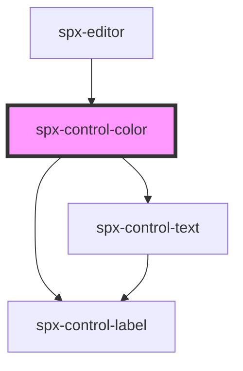

# spx-control-color

<!-- Auto Generated Below -->

## Properties

| Property | Attribute | Description | Type     | Default     |
| -------- | --------- | ----------- | -------- | ----------- |
| `color`  | `color`   |             | `string` | `undefined` |
| `label`  | `label`   |             | `string` | `undefined` |

## Dependencies

### Used by

 - [spx-editor](../../elements/spx-editor)

### Depends on

- [spx-control-label](../spx-control-label)
- [spx-control-text](../spx-control-text)

### Graph

----------------------------------------------

*Built with [StencilJS](https://stenciljs.com/)*
