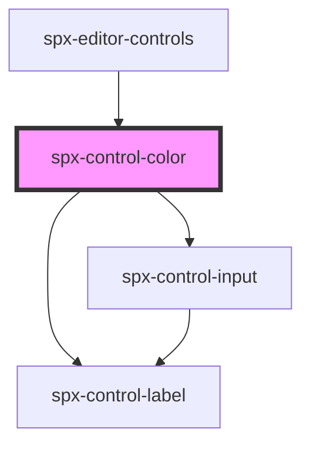

# spx-control-color

<!-- Auto Generated Below -->

## Properties

| Property      | Attribute | Description | Type       | Default          |
| ------------- | --------- | ----------- | ---------- | ---------------- |
| `data`        | `data`    |             | `string`   | `undefined`      |
| `handleInput` | --        |             | `Function` | `function () {}` |
| `label`       | `label`   |             | `string`   | `undefined`      |
| `value`       | `value`   |             | `string`   | `undefined`      |

## Dependencies

### Used by

 - [spx-editor-controls](../../editor/spx-editor-controls)

### Depends on

- [spx-control-label](../spx-control-label)
- [spx-control-input](../spx-control-input)

### Graph

----------------------------------------------

*Built with [StencilJS](https://stenciljs.com/)*
