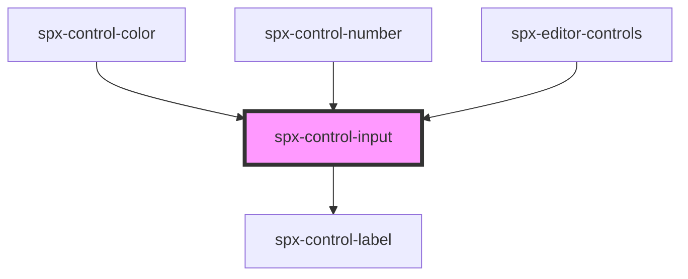

# spx-control-input

<!-- Auto Generated Below -->

## Properties

| Property      | Attribute     | Description | Type       | Default          |
| ------------- | ------------- | ----------- | ---------- | ---------------- |
| `data`        | `data`        |             | `string`   | `undefined`      |
| `handleInput` | --            |             | `Function` | `function () {}` |
| `label`       | `label`       |             | `string`   | `undefined`      |
| `max`         | `max`         |             | `number`   | `undefined`      |
| `min`         | `min`         |             | `number`   | `undefined`      |
| `placeholder` | `placeholder` |             | `string`   | `undefined`      |
| `step`        | `step`        |             | `number`   | `undefined`      |
| `type`        | `type`        |             | `string`   | `'text'`         |
| `value`       | `value`       |             | `string`   | `undefined`      |

## Dependencies

### Used by

 - [spx-control-color](../spx-control-color)
 - [spx-control-number](../spx-control-number)
 - [spx-editor-controls](../../editor/spx-editor-controls)

### Depends on

- [spx-control-label](../spx-control-label)

### Graph

----------------------------------------------

*Built with [StencilJS](https://stenciljs.com/)*
