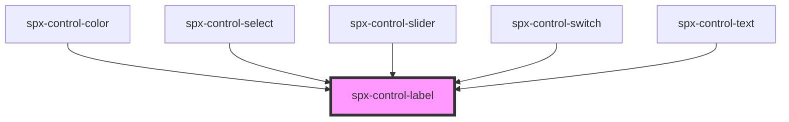

# spx-control-label

<!-- Auto Generated Below -->

## Properties

| Property | Attribute | Description | Type      | Default     |
| -------- | --------- | ----------- | --------- | ----------- |
| `label`  | `label`   |             | `string`  | `undefined` |
| `mb`     | `mb`      |             | `boolean` | `undefined` |

## Dependencies

### Used by

 - [spx-control-color](../spx-control-color)
 - [spx-control-select](../spx-control-select)
 - [spx-control-slider](../spx-control-slider)
 - [spx-control-switch](../spx-control-switch)
 - [spx-control-text](../spx-control-text)

### Graph

----------------------------------------------

*Built with [StencilJS](https://stenciljs.com/)*
