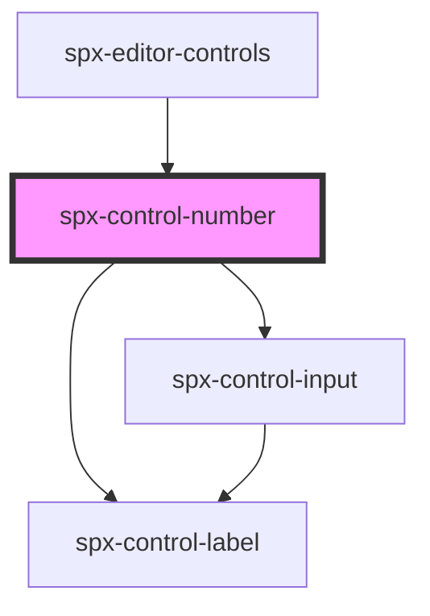

# spx-control-slider

<!-- Auto Generated Below -->

## Properties

| Property      | Attribute      | Description | Type      | Default     |
| ------------- | -------------- | ----------- | --------- | ----------- |
| `data`        | `data`         |             | `string`  | `undefined` |
| `handleInput` | `handle-input` |             | `any`     | `undefined` |
| `label`       | `label`        |             | `string`  | `undefined` |
| `max`         | `max`          |             | `number`  | `undefined` |
| `min`         | `min`          |             | `number`  | `undefined` |
| `slider`      | `slider`       |             | `boolean` | `false`     |
| `start`       | `start`        |             | `number`  | `undefined` |
| `step`        | `step`         |             | `number`  | `undefined` |
| `value`       | `value`        |             | `string`  | `undefined` |

## Dependencies

### Used by

 - [spx-editor-controls](../../editor/spx-editor-controls)

### Depends on

- [spx-control-label](../spx-control-label)
- [spx-control-input](../spx-control-input)

### Graph

----------------------------------------------

*Built with [StencilJS](https://stenciljs.com/)*
