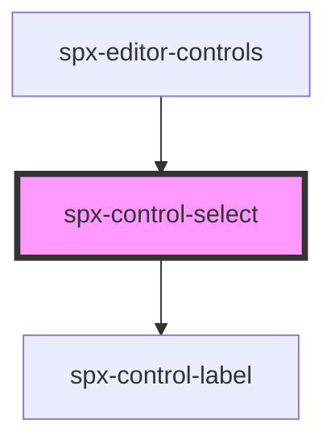

# spx-control-select

<!-- Auto Generated Below -->

## Properties

| Property      | Attribute   | Description | Type       | Default     |
| ------------- | ----------- | ----------- | ---------- | ----------- |
| `data`        | `data`      |             | `string`   | `undefined` |
| `delimiter`   | `delimiter` |             | `string`   | `','`       |
| `handleInput` | --          |             | `Function` | `undefined` |
| `label`       | `label`     |             | `string`   | `undefined` |
| `options`     | `options`   |             | `string`   | `undefined` |
| `value`       | `value`     |             | `string`   | `undefined` |

## Dependencies

### Used by

 - [spx-editor-controls](../../editor/spx-editor-controls)

### Depends on

- [spx-control-label](../spx-control-label)

### Graph

----------------------------------------------

*Built with [StencilJS](https://stenciljs.com/)*
