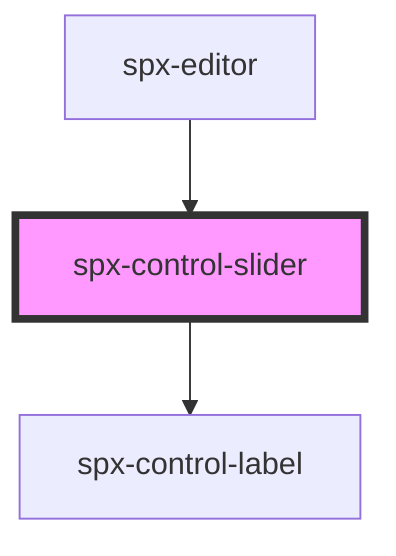

# spx-control-slider

<!-- Auto Generated Below -->

## Properties

| Property       | Attribute       | Description | Type     | Default     |
| -------------- | --------------- | ----------- | -------- | ----------- |
| `handleChange` | `handle-change` |             | `any`    | `undefined` |
| `label`        | `label`         |             | `string` | `undefined` |
| `max`          | `max`           |             | `number` | `undefined` |
| `min`          | `min`           |             | `number` | `undefined` |
| `start`        | `start`         |             | `number` | `undefined` |

## Dependencies

### Used by

 - [spx-editor](../../elements/spx-editor)

### Depends on

- [spx-control-label](../spx-control-label)

### Graph

----------------------------------------------

*Built with [StencilJS](https://stenciljs.com/)*
