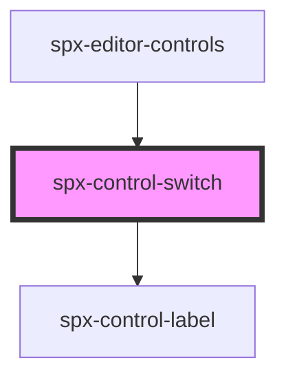

# spx-control-switch

<!-- Auto Generated Below -->

## Properties

| Property      | Attribute | Description | Type       | Default     |
| ------------- | --------- | ----------- | ---------- | ----------- |
| `checked`     | `checked` |             | `boolean`  | `undefined` |
| `data`        | `data`    |             | `string`   | `undefined` |
| `handleInput` | --        |             | `Function` | `undefined` |
| `label`       | `label`   |             | `string`   | `undefined` |

## Dependencies

### Used by

 - [spx-editor-controls](../../editor/spx-editor-controls)

### Depends on

- [spx-control-label](../spx-control-label)

### Graph

----------------------------------------------

*Built with [StencilJS](https://stenciljs.com/)*
