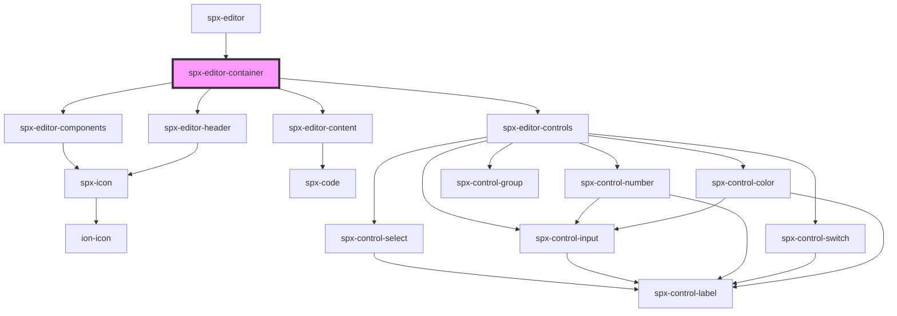

# spx-editor

<!-- Auto Generated Below -->

## Dependencies

### Used by

 - [spx-editor](../spx-editor)

### Depends on

- [spx-editor-components](../spx-editor-components)
- [spx-editor-header](../spx-editor-header)
- [spx-editor-content](../spx-editor-content)
- [spx-editor-controls](../spx-editor-controls)

### Graph

----------------------------------------------

*Built with [StencilJS](https://stenciljs.com/)*
