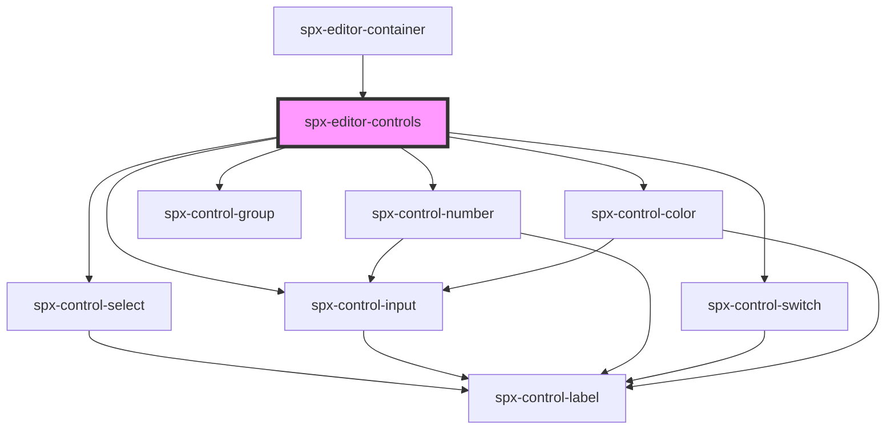

# spx-editor-controls

<!-- Auto Generated Below -->

## Dependencies

### Used by

 - [spx-editor-container](../spx-editor-container)

### Depends on

- [spx-control-select](../../controls/spx-control-select)
- [spx-control-input](../../controls/spx-control-input)
- [spx-control-number](../../controls/spx-control-number)
- [spx-control-switch](../../controls/spx-control-switch)
- [spx-control-color](../../controls/spx-control-color)
- [spx-control-group](../../controls/spx-control-group)

### Graph

----------------------------------------------

*Built with [StencilJS](https://stenciljs.com/)*
