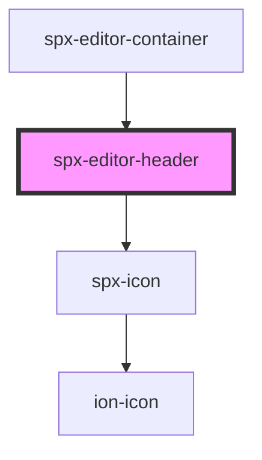

# spx-editor-header

<!-- Auto Generated Below -->

## Dependencies

### Used by

 - [spx-editor-container](../spx-editor-container)

### Depends on

- [spx-icon](../../elements/spx-icon)

### Graph

----------------------------------------------

*Built with [StencilJS](https://stenciljs.com/)*
