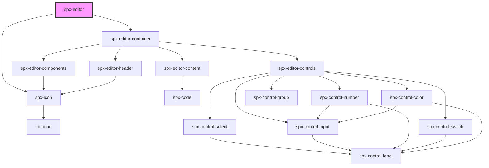

# spx-editor

<!-- Auto Generated Below -->

## Properties

| Property | Attribute | Description | Type     | Default     |
| -------- | --------- | ----------- | -------- | ----------- |
| `height` | `height`  |             | `string` | `undefined` |

## Dependencies

### Depends on

- [spx-icon](../../elements/spx-icon)
- [spx-editor-container](../spx-editor-container)

### Graph

----------------------------------------------

*Built with [StencilJS](https://stenciljs.com/)*
