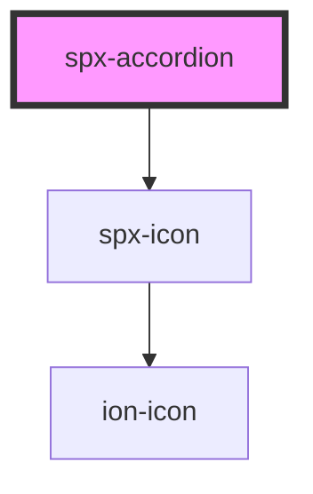

# spx-accordion

<!-- Auto Generated Below -->

## Properties

| Property                           | Attribute                              | Description                                        | Type      | Default                       |
| ---------------------------------- | -------------------------------------- | -------------------------------------------------- | --------- | ----------------------------- |
| `classContent`                     | `class-content`                        |                                                    | `string`  | `undefined`                   |
| `classContentActive`               | `class-content-active`                 |                                                    | `string`  | `undefined`                   |
| `classContentInactive`             | `class-content-inactive`               |                                                    | `string`  | `undefined`                   |
| `classContentText`                 | `class-content-text`                   |                                                    | `string`  | `undefined`                   |
| `classContentTextActive`           | `class-content-text-active`            |                                                    | `string`  | `undefined`                   |
| `classContentTextInactive`         | `class-content-text-inactive`          |                                                    | `string`  | `undefined`                   |
| `classHeader`                      | `class-header`                         |                                                    | `string`  | `undefined`                   |
| `classHeaderActive`                | `class-header-active`                  |                                                    | `string`  | `undefined`                   |
| `classHeaderIcon`                  | `class-header-icon`                    |                                                    | `string`  | `undefined`                   |
| `classHeaderIconActive`            | `class-header-icon-active`             |                                                    | `string`  | `undefined`                   |
| `classHeaderIconContainer`         | `class-header-icon-container`          |                                                    | `string`  | `undefined`                   |
| `classHeaderIconContainerActive`   | `class-header-icon-container-active`   |                                                    | `string`  | `undefined`                   |
| `classHeaderIconContainerInactive` | `class-header-icon-container-inactive` |                                                    | `string`  | `undefined`                   |
| `classHeaderIconInactive`          | `class-header-icon-inactive`           |                                                    | `string`  | `undefined`                   |
| `classHeaderInactive`              | `class-header-inactive`                |                                                    | `string`  | `undefined`                   |
| `classHeaderText`                  | `class-header-text`                    |                                                    | `string`  | `undefined`                   |
| `classHeaderTextActive`            | `class-header-text-active`             |                                                    | `string`  | `undefined`                   |
| `classHeaderTextInactive`          | `class-header-text-inactive`           |                                                    | `string`  | `undefined`                   |
| `contentColor`                     | `content-color`                        |                                                    | `string`  | `'var(--spx-color-gray-900)'` |
| `contentFontSize`                  | `content-font-size`                    |                                                    | `string`  | `'var(--spx-font-size)'`      |
| `contentFontSizeMax`               | `content-font-size-max`                |                                                    | `number`  | `1.2`                         |
| `contentFontSizeMin`               | `content-font-size-min`                |                                                    | `number`  | `1`                           |
| `contentText`                      | `content-text`                         | Content text.                                      | `string`  | `'Default Content Text'`      |
| `contentTextTag`                   | `content-text-tag`                     | Content text tag.                                  | `string`  | `'span'`                      |
| `gap`                              | `gap`                                  | Space between header and content.                  | `string`  | `'0.4em'`                     |
| `gapMax`                           | `gap-max`                              |                                                    | `number`  | `1.2`                         |
| `gapMin`                           | `gap-min`                              |                                                    | `number`  | `1`                           |
| `headerColor`                      | `header-color`                         |                                                    | `string`  | `'var(--spx-color-gray-900)'` |
| `headerFontSize`                   | `header-font-size`                     |                                                    | `string`  | `'var(--spx-font-size)'`      |
| `headerFontSizeMax`                | `header-font-size-max`                 |                                                    | `number`  | `1.2`                         |
| `headerFontSizeMin`                | `header-font-size-min`                 |                                                    | `number`  | `1`                           |
| `headerGap`                        | `header-gap`                           | Gap between header text and icon.                  | `string`  | `'0.4em'`                     |
| `headerGapMax`                     | `header-gap-max`                       |                                                    | `number`  | `1`                           |
| `headerGapMin`                     | `header-gap-min`                       |                                                    | `number`  | `0.6`                         |
| `headerText`                       | `header-text`                          | Header text.                                       | `string`  | `'Default Header Text'`       |
| `headerTextOpen`                   | `header-text-open`                     | Header text when component is closed.              | `string`  | `undefined`                   |
| `headerTextTag`                    | `header-text-tag`                      | Header text tag.                                   | `string`  | `'span'`                      |
| `icon`                             | `icon`                                 | Icon.                                              | `string`  | `'arrow-down'`                |
| `iconTransform`                    | `icon-transform`                       | Icon transform.                                    | `string`  | `'rotate(180deg)'`            |
| `iconType`                         | `icon-type`                            | Icon type.                                         | `string`  | `'ionicons'`                  |
| `link`                             | `link`                                 | Sets the ID to link different accordions together. | `string`  | `undefined`                   |
| `linkType`                         | `link-type`                            | Sets the type of link.                             | `string`  | `'open'`                      |
| `openState`                        | `open`                                 | State of accordion.                                | `boolean` | `false`                       |
| `reverse`                          | `reverse`                              | Reverse icon positioning.                          | `boolean` | `undefined`                   |
| `styling`                          | `styling`                              | Styling.                                           | `string`  | `'default'`                   |

## Events

| Event                 | Description    | Type               |
| --------------------- | -------------- | ------------------ |
| `spxAccordionDidLoad` | [event:loaded] | `CustomEvent<any>` |

## Methods

### `close() => Promise<void>`

Closes the accordion.

#### Returns

Type: `Promise<void>`

### `open() => Promise<void>`

Opens the accordion.

#### Returns

Type: `Promise<void>`

### `toggle() => Promise<void>`

Toggles the accordion.

#### Returns

Type: `Promise<void>`

## Slots

| Slot        | Description           |
| ----------- | --------------------- |
| `"content"` | Slot for the content. |
| `"header"`  | Slot for the header.  |

## Dependencies

### Depends on

- [spx-icon](../spx-icon)

### Graph

----------------------------------------------

*Built with [StencilJS](https://stenciljs.com/)*
