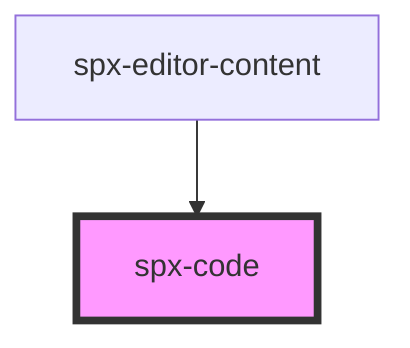

# spx-code

<!-- Auto Generated Below -->

## Properties

| Property                       | Attribute                         | Description                                                               | Type      | Default                       |
| ------------------------------ | --------------------------------- | ------------------------------------------------------------------------- | --------- | ----------------------------- |
| `background`                   | `background`                      |                                                                           | `string`  | `'var(--spx-color-gray-900)'` |
| `borderRadius`                 | `border-radius`                   |                                                                           | `string`  | `'var(--spx-border-radius)'`  |
| `clipboard`                    | `clipboard`                       | Enable clipboard button.                                                  | `boolean` | `true`                        |
| `clipboardButtonBackground`    | `clipboard-button-background`     |                                                                           | `string`  | `'var(--spx-color-gray-800)'` |
| `clipboardButtonColor`         | `clipboard-button-color`          |                                                                           | `string`  | `'var(--spx-color-gray-400)'` |
| `clipboardButtonFontSize`      | `clipboard-button-font-size`      |                                                                           | `string`  | `'12px'`                      |
| `clipboardButtonFontWeight`    | `clipboard-button-font-weight`    |                                                                           | `any`     | `'600'`                       |
| `clipboardButtonPadding`       | `clipboard-button-padding`        |                                                                           | `string`  | `'6px 12px'`                  |
| `clipboardButtonText`          | `clipboard-button-text`           |                                                                           | `string`  | `'Copy'`                      |
| `clipboardButtonTextCopied`    | `clipboard-button-text-copied`    |                                                                           | `string`  | `'Copied!'`                   |
| `clipboardButtonTextTransform` | `clipboard-button-text-transform` |                                                                           | `string`  | `'uppercase'`                 |
| `content`                      | `content`                         | Can be used instead of the inner slot.                                    | `string`  | `undefined`                   |
| `filter`                       | `filter`                          |                                                                           | `string`  | `undefined`                   |
| `fontSize`                     | `font-size`                       |                                                                           | `string`  | `'clamp(12px, 1.6vw, 16px)'`  |
| `hideScrollbar`                | `hide-scrollbar`                  | Show scrollbar.                                                           | `boolean` | `false`                       |
| `lazy`                         | `lazy`                            | Load component when it enters the viewport.                               | `boolean` | `undefined`                   |
| `lineNumbers`                  | `line-numbers`                    | Enable line numbers.                                                      | `boolean` | `true`                        |
| `lineNumbersBackground`        | `line-numbers-background`         |                                                                           | `string`  | `'var(--spx-color-gray-800)'` |
| `lineNumbersColor`             | `line-numbers-color`              |                                                                           | `string`  | `'var(--spx-color-gray-400)'` |
| `lineNumbersStart`             | `line-numbers-start`              | Start of line number.                                                     | `number`  | `1`                           |
| `maxWidth`                     | `max-width`                       |                                                                           | `string`  | `'100%'`                      |
| `padding`                      | `padding`                         |                                                                           | `string`  | `'clamp(20px, 2.4vw, 40px)'`  |
| `theme`                        | `theme`                           | Colour theme.                                                             | `string`  | `'default'`                   |
| `type`                         | `type`                            | Determines the programming language.                                      | `string`  | `'markup'`                    |
| `whitespaceLeftTrim`           | `whitespace-left-trim`            | Removes all whitespace from the top of the code block.                    | `boolean` | `true`                        |
| `whitespaceRemoveIndent`       | `whitespace-remove-indent`        | If the whole code block is indented too much it removes the extra indent. | `boolean` | `true`                        |
| `whitespaceRemoveTrailing`     | `whitespace-remove-trailing`      | Removes trailing whitespace on all lines.                                 | `boolean` | `true`                        |
| `whitespaceRightTrim`          | `whitespace-right-trim`           | Removes all whitespace from the bottom of the code block.                 | `boolean` | `true`                        |

## Events

| Event            | Description    | Type               |
| ---------------- | -------------- | ------------------ |
| `spxCodeDidLoad` | [event:loaded] | `CustomEvent<any>` |

## Slots

| Slot      | Description              |
| --------- | ------------------------ |
| `"inner"` | Slot (between HTML tag). |

## Dependencies

### Used by

 - [spx-editor-content](../../editor/spx-editor-content)

### Graph

----------------------------------------------

*Built with [StencilJS](https://stenciljs.com/)*
