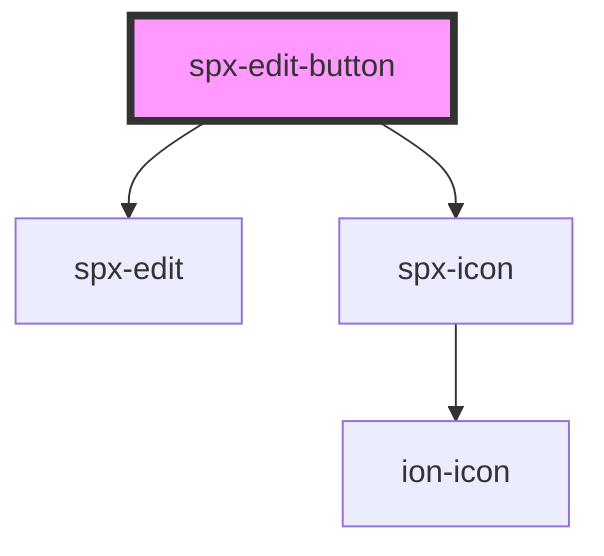

# spx-edit-button

<!-- Auto Generated Below -->

## Properties

| Property             | Attribute              | Description                                                                                                                                                                                                    | Type                                              | Default                       |
| -------------------- | ---------------------- | -------------------------------------------------------------------------------------------------------------------------------------------------------------------------------------------------------------- | ------------------------------------------------- | ----------------------------- |
| `background`         | `background`           |                                                                                                                                                                                                                | `string`                                          | `'var(--spx-color-gray-900)'` |
| `backgroundDiscard`  | `background-discard`   | Discard button background.                                                                                                                                                                                     | `string`                                          | `'var(--spx-color-gray-600)'` |
| `border`             | `border`               |                                                                                                                                                                                                                | `string`                                          | `'none'`                      |
| `borderDiscard`      | `border-discard`       |                                                                                                                                                                                                                | `string`                                          | `'none'`                      |
| `borderRadius`       | `border-radius`        |                                                                                                                                                                                                                | `string`                                          | `'var(--spx-border-radius)'`  |
| `bottom`             | `bottom`               |                                                                                                                                                                                                                | `string`                                          | `'1em'`                       |
| `classButton`        | `class-button`         |                                                                                                                                                                                                                | `string`                                          | `undefined`                   |
| `classButtonDiscard` | `class-button-discard` |                                                                                                                                                                                                                | `string`                                          | `undefined`                   |
| `classLoader`        | `class-loader`         |                                                                                                                                                                                                                | `string`                                          | `undefined`                   |
| `color`              | `color`                |                                                                                                                                                                                                                | `string`                                          | `'#ffffff'`                   |
| `colorDiscard`       | `color-discard`        | Discard button color.                                                                                                                                                                                          | `string`                                          | `'#ffffff'`                   |
| `editId`             | `edit-id`              | Corresponding ID for editable fields. This property is needed when multiple edit-button components are used on the page. Simply apply a "data-spx-edit-id" attribute with the same value to editable elements. | `string`                                          | `undefined`                   |
| `fontSize`           | `font-size`            |                                                                                                                                                                                                                | `string`                                          | `'var(--spx-font-size)'`      |
| `fontSizeMax`        | `font-size-max`        |                                                                                                                                                                                                                | `number`                                          | `1.2`                         |
| `fontSizeMin`        | `font-size-min`        |                                                                                                                                                                                                                | `number`                                          | `1`                           |
| `gap`                | `gap`                  | Gap between the buttons.                                                                                                                                                                                       | `string`                                          | `'0.4em'`                     |
| `left`               | `left`                 |                                                                                                                                                                                                                | `string`                                          | `undefined`                   |
| `loaderColor`        | `loader-color`         |                                                                                                                                                                                                                | `string`                                          | `'#ffffff'`                   |
| `loaderGap`          | `loader-gap`           |                                                                                                                                                                                                                | `string`                                          | `'0.5em'`                     |
| `padding`            | `padding`              |                                                                                                                                                                                                                | `string`                                          | `'1em 1.2em'`                 |
| `paddingXMax`        | `padding-x-max`        |                                                                                                                                                                                                                | `number`                                          | `1.4`                         |
| `paddingXMin`        | `padding-x-min`        |                                                                                                                                                                                                                | `number`                                          | `1`                           |
| `paddingYMax`        | `padding-y-max`        |                                                                                                                                                                                                                | `number`                                          | `1.2`                         |
| `paddingYMin`        | `padding-y-min`        |                                                                                                                                                                                                                | `number`                                          | `0.7`                         |
| `position`           | `position`             | Position property of component.                                                                                                                                                                                | `"absolute" \| "fixed" \| "relative" \| "static"` | `'fixed'`                     |
| `right`              | `right`                |                                                                                                                                                                                                                | `string`                                          | `'1em'`                       |
| `styling`            | `styling`              | Styling.                                                                                                                                                                                                       | `string`                                          | `'default'`                   |
| `test`               | `test`                 |                                                                                                                                                                                                                | `boolean`                                         | `false`                       |
| `textDiscard`        | `text-discard`         | Discard button text.                                                                                                                                                                                           | `string`                                          | `'Discard'`                   |
| `textEdit`           | `text-edit`            | Edit button text.                                                                                                                                                                                              | `string`                                          | `'Edit site'`                 |
| `textSave`           | `text-save`            | Save button text.                                                                                                                                                                                              | `string`                                          | `'Save'`                      |
| `top`                | `top`                  |                                                                                                                                                                                                                | `string`                                          | `undefined`                   |
| `zIndex`             | `z-index`              |                                                                                                                                                                                                                | `number`                                          | `99`                          |

## Events

| Event                  | Description                              | Type               |
| ---------------------- | ---------------------------------------- | ------------------ |
| `spxEditButtonDidLoad` | [event:loaded]                           | `CustomEvent<any>` |
| `spxEditButtonDiscard` | Fires after pressing the discard button. | `CustomEvent<any>` |
| `spxEditButtonSave`    | Fires after pressing the save button.    | `CustomEvent<any>` |

## Methods

### `discard() => Promise<void>`

Discard changes.

#### Returns

Type: `Promise<void>`

### `edit() => Promise<void>`

Enable editing.

#### Returns

Type: `Promise<void>`

### `save() => Promise<void>`

Save changes.

#### Returns

Type: `Promise<void>`

## Dependencies

### Depends on

- [spx-edit](.)
- [spx-icon](../spx-icon)

### Graph

----------------------------------------------

*Built with [StencilJS](https://stenciljs.com/)*
