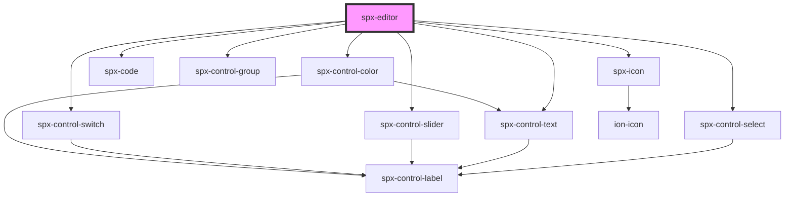

# spx-editor

<!-- Auto Generated Below -->

## Properties

| Property     | Attribute     | Description | Type     | Default     |
| ------------ | ------------- | ----------- | -------- | ----------- |
| `active`     | `active`      |             | `string` | `undefined` |
| `activeName` | `active-name` |             | `string` | `undefined` |

## Methods

### `load(data: any) => Promise<void>`

Load an array of JSON objects in the spx format.

#### Returns

Type: `Promise<void>`

## Dependencies

### Depends on

- [spx-icon](../spx-icon)
- [spx-code](../spx-code)
- [spx-control-group](../../controls/spx-control-group)
- [spx-control-select](../../controls/spx-control-select)
- [spx-control-text](../../controls/spx-control-text)
- [spx-control-slider](../../controls/spx-control-slider)
- [spx-control-switch](../../controls/spx-control-switch)
- [spx-control-color](../../controls/spx-control-color)

### Graph

----------------------------------------------

*Built with [StencilJS](https://stenciljs.com/)*
