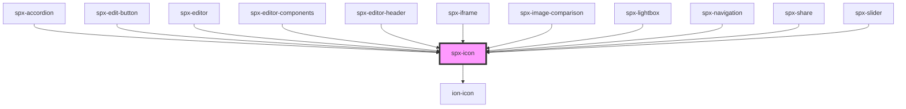

# spx-icon

<!-- Auto Generated Below -->

## Properties

| Property  | Attribute  | Description | Type     | Default      |
| --------- | ---------- | ----------- | -------- | ------------ |
| `color`   | `color`    |             | `string` | `'inherit'`  |
| `icon`    | `icon`     | Icon code.  | `string` | `undefined`  |
| `size`    | `size`     | Icon size.  | `string` | `'1em'`      |
| `sizeMax` | `size-max` |             | `number` | `1`          |
| `sizeMin` | `size-min` |             | `number` | `0.8`        |
| `styling` | `styling`  | Styling.    | `string` | `'default'`  |
| `type`    | `type`     | Icon type.  | `string` | `'ionicons'` |
| `width`   | `width`    |             | `string` | `undefined`  |

## Events

| Event            | Description    | Type               |
| ---------------- | -------------- | ------------------ |
| `spxIconDidLoad` | [event:loaded] | `CustomEvent<any>` |

## Dependencies

### Used by

 - [spx-accordion](../spx-accordion)
 - [spx-edit-button](../spx-edit-button)
 - [spx-editor](../../editor/spx-editor)
 - [spx-editor-components](../../editor/spx-editor-components)
 - [spx-editor-header](../../editor/spx-editor-header)
 - [spx-iframe](../spx-iframe)
 - [spx-image-comparison](../spx-image-comparison)
 - [spx-lightbox](../spx-lightbox)
 - [spx-navigation](../spx-navigation)
 - [spx-share](../spx-share)
 - [spx-slider](../spx-slider)

### Depends on

- ion-icon

### Graph

----------------------------------------------

*Built with [StencilJS](https://stenciljs.com/)*
