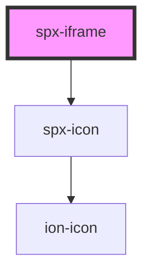

# spx-iframe

<!-- Auto Generated Below -->

## Properties

| Property             | Attribute              | Description                                      | Type      | Default                       |
| -------------------- | ---------------------- | ------------------------------------------------ | --------- | ----------------------------- |
| `fit`                | `fit`                  | Automatically resize iframe to fit content.      | `boolean` | `undefined`                   |
| `lazy`               | `lazy`                 | Lazy load content.                               | `boolean` | `undefined`                   |
| `loaderBackground`   | `loader-background`    |                                                  | `string`  | `'var(--spx-color-gray-900)'` |
| `loaderBorderRadius` | `loader-border-radius` |                                                  | `string`  | `'var(--spx-border-radius)'`  |
| `loaderColor`        | `loader-color`         |                                                  | `string`  | `'#ffffff'`                   |
| `loaderPadding`      | `loader-padding`       |                                                  | `string`  | `'0.8em'`                     |
| `minHeight`          | `min-height`           |                                                  | `string`  | `'400px'`                     |
| `size`               | `size`                 | Screen size of the site shown inside the iframe. | `string`  | `'1440px'`                    |
| `src`                | `src`                  | Source for the iframe.                           | `string`  | `'https://spx.dev'`           |

## Events

| Event              | Description    | Type               |
| ------------------ | -------------- | ------------------ |
| `spxIframeDidLoad` | [event:loaded] | `CustomEvent<any>` |

## Dependencies

### Depends on

- [spx-icon](../spx-icon)

### Graph

----------------------------------------------

*Built with [StencilJS](https://stenciljs.com/)*
