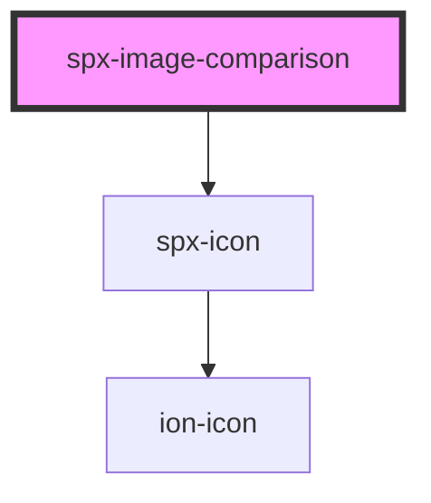

# spx-image-comparison

<!-- Auto Generated Below -->

## Properties

| Property    | Attribute    | Description                                       | Type      | Default                                         |
| ----------- | ------------ | ------------------------------------------------- | --------- | ----------------------------------------------- |
| `active`    | `active`     |                                                   | `boolean` | `undefined`                                     |
| `color`     | `color`      |                                                   | `string`  | `'#ffffff'`                                     |
| `height`    | `height`     |                                                   | `string`  | `'100%'`                                        |
| `iconColor` | `icon-color` |                                                   | `string`  | `'var(--spx-color-gray-900)'`                   |
| `lazy`      | `lazy`       | Lazy load images.                                 | `boolean` | `undefined`                                     |
| `srcAfter`  | `src-after`  | Image URL of the before image.                    | `string`  | `'https://source.unsplash.com/random/1200x300'` |
| `srcBefore` | `src-before` | Image URL of the after image.                     | `string`  | `'https://source.unsplash.com/random/1201x300'` |
| `start`     | `start`      | Opening state in pixels.                          | `number`  | `150`                                           |
| `steps`     | `steps`      | Step amount when using component with arrow keys. | `number`  | `10`                                            |

## Events

| Event                       | Description    | Type               |
| --------------------------- | -------------- | ------------------ |
| `spxImageComparisonDidLoad` | [event:loaded] | `CustomEvent<any>` |

## Dependencies

### Depends on

- [spx-icon](../spx-icon)

### Graph

----------------------------------------------

*Built with [StencilJS](https://stenciljs.com/)*
