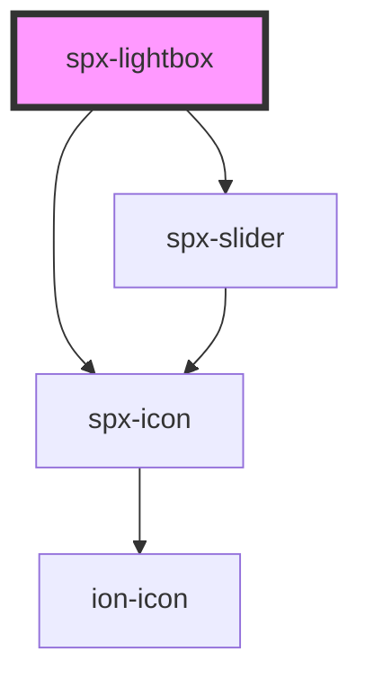

# spx-lightbox

<!-- Auto Generated Below -->

## Properties

| Property                | Attribute                 | Description                                                                  | Type      | Default                        |
| ----------------------- | ------------------------- | ---------------------------------------------------------------------------- | --------- | ------------------------------ |
| `bodyOverflow`          | `body-overflow`           | If 'overflow: hidden' should be applied to the body when a lightbox is open. | `boolean` | `true`                         |
| `closeButton`           | `close-button`            | Show close button.                                                           | `boolean` | `true`                         |
| `closeButtonColor`      | `close-button-color`      |                                                                              | `string`  | `'#ffffff'`                    |
| `overlayBackdropFilter` | `overlay-backdrop-filter` |                                                                              | `string`  | `'var(--spx-backdrop-filter)'` |
| `overlayBackground`     | `overlay-background`      |                                                                              | `string`  | `'rgba(0,0,0,0.8)'`            |
| `spxSlider`             | `spx-slider`              | [component:spx-slider]                                                       | `string`  | `undefined`                    |
| `target`                | `target`                  | [prop:target]                                                                | `string`  | `'img'`                        |

## Events

| Event                | Description    | Type               |
| -------------------- | -------------- | ------------------ |
| `spxLightboxDidLoad` | [event:loaded] | `CustomEvent<any>` |

## Dependencies

### Depends on

- [spx-icon](../spx-icon)
- [spx-slider](../spx-slider)

### Graph

----------------------------------------------

*Built with [StencilJS](https://stenciljs.com/)*
