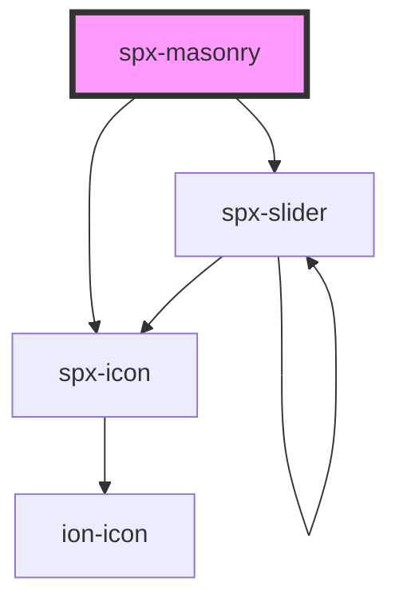

# spx-masonry

<!-- Auto Generated Below -->

## Properties

| Property            | Attribute             | Description                                          | Type      | Default     |
| ------------------- | --------------------- | ---------------------------------------------------- | --------- | ----------- |
| `columns`           | `columns`             | Number of columns.                                   | `number`  | `4`         |
| `gap`               | `gap`                 | Gap between images.                                  | `string`  | `'10px'`    |
| `imageSize`         | `image-size`          | WordPress media size when using the helper function. | `string`  | `undefined` |
| `imageSrc`          | `image-src`           | Gets images from an ACF or Metabox field.            | `string`  | `'acf'`     |
| `images`            | `images`              | Gets images from an ACF or Metabox field.            | `string`  | `undefined` |
| `lazy`              | `lazy`                | Lazy load images.                                    | `boolean` | `undefined` |
| `lightbox`          | `lightbox`            | [prop:lightbox]                                      | `boolean` | `undefined` |
| `spxLightbox`       | `spx-lightbox`        | [component:spx-lightbox]                             | `string`  | `undefined` |
| `spxLightboxSlider` | `spx-lightbox-slider` | [component:spx-slider]                               | `string`  | `undefined` |

## Events

| Event               | Description    | Type               |
| ------------------- | -------------- | ------------------ |
| `spxMasonryDidLoad` | [event:loaded] | `CustomEvent<any>` |

## Slots

| Slot      | Description              |
| --------- | ------------------------ |
| `"inner"` | Slot (between HTML tag). |

## Dependencies

### Depends on

- [spx-icon](../spx-icon)
- [spx-slider](../spx-slider)

### Graph

----------------------------------------------

*Built with [StencilJS](https://stenciljs.com/)*
