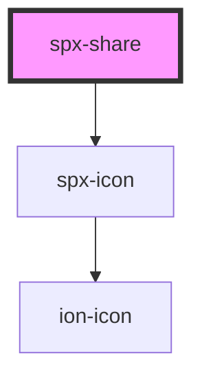

# spx-share

<!-- Auto Generated Below -->

## Properties

| Property           | Attribute            | Description                | Type      | Default                             |
| ------------------ | -------------------- | -------------------------- | --------- | ----------------------------------- |
| `fontSize`         | `font-size`          |                            | `string`  | `'var(--spx-font-size)'`            |
| `fontSizeMax`      | `font-size-max`      |                            | `number`  | `1.4`                               |
| `fontSizeMin`      | `font-size-min`      |                            | `number`  | `1`                                 |
| `itemBackground`   | `item-background`    |                            | `string`  | `undefined`                         |
| `itemBorderRadius` | `item-border-radius` |                            | `string`  | `'var(--spx-border-radius)'`        |
| `itemColor`        | `item-color`         | Gap between buttons.       | `string`  | `undefined`                         |
| `itemFilterHover`  | `item-filter-hover`  | Filter hover.              | `string`  | `'brightness(110%) saturate(120%)'` |
| `itemGap`          | `item-gap`           | Gap between buttons.       | `string`  | `'0.5em'`                           |
| `itemGapMax`       | `item-gap-max`       |                            | `number`  | `1`                                 |
| `itemGapMin`       | `item-gap-min`       |                            | `number`  | `0.4`                               |
| `itemPadding`      | `item-padding`       |                            | `string`  | `'0.5em'`                           |
| `itemPaddingMax`   | `item-padding-max`   |                            | `number`  | `1.2`                               |
| `itemPaddingMin`   | `item-padding-min`   |                            | `number`  | `0.5`                               |
| `itemSize`         | `item-size`          |                            | `string`  | `'1em'`                             |
| `itemSizeMax`      | `item-size-max`      |                            | `number`  | `1`                                 |
| `itemSizeMin`      | `item-size-min`      |                            | `number`  | `0.7`                               |
| `styling`          | `styling`            | Styling.                   | `string`  | `'default'`                         |
| `target`           | `target`             | Link href target.          | `string`  | `'_blank'`                          |
| `theme`            | `theme`              | Button theme.              | `string`  | `'default'`                         |
| `vertical`         | `vertical`           | Render buttons vertically. | `boolean` | `undefined`                         |

## Events

| Event             | Description    | Type               |
| ----------------- | -------------- | ------------------ |
| `spxShareDidLoad` | [event:loaded] | `CustomEvent<any>` |

## Dependencies

### Depends on

- [spx-icon](../spx-icon)

### Graph

----------------------------------------------

*Built with [StencilJS](https://stenciljs.com/)*
