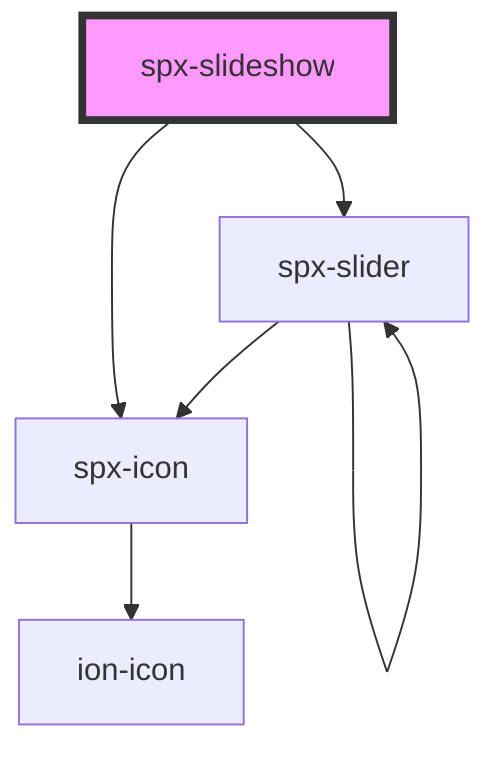

# spx-slideshow

<!-- Auto Generated Below -->

## Properties

| Property            | Attribute             | Description                                                                   | Type      | Default     |
| ------------------- | --------------------- | ----------------------------------------------------------------------------- | --------- | ----------- |
| `duration`          | `duration`            | Duration of slideshow to complete one cycle.                                  | `string`  | `'60s'`     |
| `gap`               | `gap`                 | Gap between inner elements.                                                   | `string`  | `'1em'`     |
| `height`            | `height`              |                                                                               | `string`  | `undefined` |
| `imageSize`         | `image-size`          | WordPress media size when using the helper function.                          | `string`  | `undefined` |
| `imageSrc`          | `image-src`           | Gets images from an ACF or Metabox field.                                     | `string`  | `undefined` |
| `images`            | `images`              | Gets images from an ACF or Metabox field.                                     | `string`  | `undefined` |
| `lazy`              | `lazy`                | Lazy load images.                                                             | `boolean` | `undefined` |
| `lightbox`          | `lightbox`            | [prop:lightbox]                                                               | `boolean` | `undefined` |
| `maxWidth`          | `max-width`           | Max width of inner elements.                                                  | `string`  | `'300px'`   |
| `objectFit`         | `object-fit`          |                                                                               | `string`  | `'contain'` |
| `overflow`          | `overflow`            | If not set with this attribute, overflow should be set on the parent element. | `string`  | `undefined` |
| `spxLightbox`       | `spx-lightbox`        | [component:spx-lightbox]                                                      | `string`  | `undefined` |
| `spxLightboxSlider` | `spx-lightbox-slider` | [component:spx-slider]                                                        | `string`  | `undefined` |

## Events

| Event                 | Description    | Type               |
| --------------------- | -------------- | ------------------ |
| `spxSlideshowDidLoad` | [event:loaded] | `CustomEvent<any>` |

## Slots

| Slot      | Description              |
| --------- | ------------------------ |
| `"inner"` | Slot (between HTML tag). |

## Dependencies

### Depends on

- [spx-icon](../spx-icon)
- [spx-slider](../spx-slider)

### Graph

----------------------------------------------

*Built with [StencilJS](https://stenciljs.com/)*
