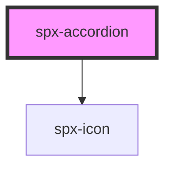

# spx-accordion

<!-- Auto Generated Below -->

## Properties

| Property                 | Attribute                  | Description                                      | Type     | Default                       |
| ------------------------ | -------------------------- | ------------------------------------------------ | -------- | ----------------------------- |
| `contentColor`           | `content-color`            |                                                  | `string` | `'var(--spx-color-gray-900)'` |
| `contentText`            | `content-text`             | Content text.                                    | `string` | `'Default Content Text'`      |
| `contentTextTag`         | `content-text-tag`         | Content text tag.                                | `string` | `'span'`                      |
| `fontSize`               | `font-size`                |                                                  | `string` | `c.fontSize`                  |
| `gap`                    | `gap`                      | Space between header and content.                | `string` | `'0.4em'`                     |
| `headerColor`            | `header-color`             |                                                  | `string` | `'var(--spx-color-gray-900)'` |
| `headerGap`              | `header-gap`               | Gap between header text and icon.                | `string` | `'0.4em'`                     |
| `headerText`             | `header-text`              | Header text.                                     | `string` | `'Default Header Text'`       |
| `headerTextTag`          | `header-text-tag`          | Header text tag.                                 | `string` | `'span'`                      |
| `indicatorIcon`          | `indicator-icon`           | Icon class. Accepts any Font Awesome icon class. | `string` | `undefined`                   |
| `indicatorIconTransform` | `indicator-icon-transform` | Indicator icon transform.                        | `string` | `'rotate(90deg)'`             |

## Methods

### `reload() => Promise<void>`

#### Returns

Type: `Promise<void>`

## Slots

| Slot        | Description |
| ----------- | ----------- |
| `"content"` | Content.    |
| `"header"`  | Header.     |

## Dependencies

### Depends on

- [spx-icon](../spx-icon)

### Graph

----------------------------------------------

*Built with [StencilJS](https://stenciljs.com/)*
