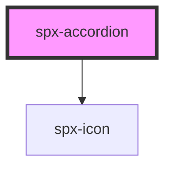

# harmoni-accordion

<!-- Auto Generated Below -->

## Properties

| Property         | Attribute          | Description | Type      | Default                     |
| ---------------- | ------------------ | ----------- | --------- | --------------------------- |
| `contentColor`   | `content-color`    |             | `string`  | `constants.stylePrimary900` |
| `contentCustom`  | `content-custom`   |             | `boolean` | `undefined`                 |
| `contentText`    | `content-text`     |             | `string`  | `'Default Content Text'`    |
| `contentTextTag` | `content-text-tag` |             | `string`  | `'span'`                    |
| `fontSize`       | `font-size`        |             | `string`  | `constants.styleFontSize`   |
| `gap`            | `gap`              |             | `string`  | `'0.4em'`                   |
| `headerColor`    | `header-color`     |             | `string`  | `constants.stylePrimary900` |
| `headerCustom`   | `header-custom`    |             | `boolean` | `undefined`                 |
| `headerGap`      | `header-gap`       |             | `string`  | `'0.4em'`                   |
| `headerText`     | `header-text`      |             | `string`  | `'Default Header Text'`     |
| `headerTextTag`  | `header-text-tag`  |             | `string`  | `'span'`                    |
| `indicatorIcon`  | `indicator-icon`   |             | `string`  | `undefined`                 |
| `styling`        | `styling`          |             | `string`  | `undefined`                 |

## Dependencies

### Depends on

- [spx-icon](../spx-icon)

### Graph

----------------------------------------------

*Built with [StencilJS](https://stenciljs.com/)*
