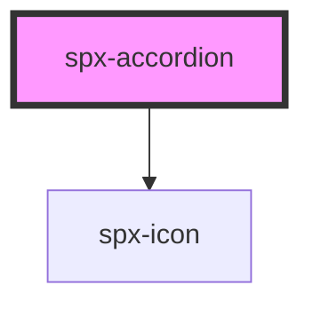

# harmoni-accordion

<!-- Auto Generated Below -->

## Properties

| Property         | Attribute          | Description | Type      | Default                  |
| ---------------- | ------------------ | ----------- | --------- | ------------------------ |
| `contentCustom`  | `content-custom`   |             | `boolean` | `undefined`              |
| `contentText`    | `content-text`     |             | `string`  | `'Default Content Text'` |
| `contentTextTag` | `content-text-tag` |             | `string`  | `'span'`                 |
| `gap`            | `gap`              |             | `string`  | `'8px'`                  |
| `headerCustom`   | `header-custom`    |             | `boolean` | `undefined`              |
| `headerGap`      | `header-gap`       |             | `string`  | `'4px'`                  |
| `headerText`     | `header-text`      |             | `string`  | `'Default Header Text'`  |
| `headerTextTag`  | `header-text-tag`  |             | `string`  | `'span'`                 |
| `iconIndicator`  | `icon-indicator`   |             | `string`  | `undefined`              |
| `styling`        | `styling`          |             | `string`  | `undefined`              |

## Dependencies

### Depends on

- [spx-icon](../spx-icon)

### Graph

----------------------------------------------

*Built with [StencilJS](https://stenciljs.com/)*
