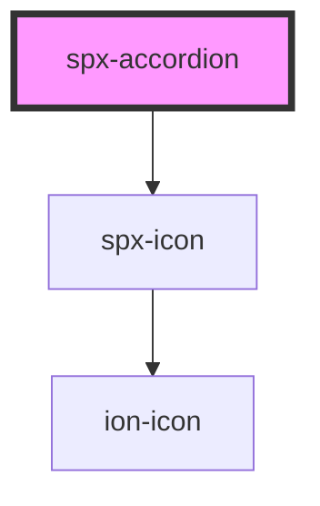

# spx-accordion

<!-- Auto Generated Below -->

## Properties

| Property                          | Attribute                            | Description                       | Type     | Default                       |
| --------------------------------- | ------------------------------------ | --------------------------------- | -------- | ----------------------------- |
| `contentColor`                    | `content-color`                      |                                   | `string` | `'var(--spx-color-gray-900)'` |
| `contentText`                     | `content-text`                       | Content text.                     | `string` | `'Default Content Text'`      |
| `contentTextTag`                  | `content-text-tag`                   | Content text tag.                 | `string` | `'span'`                      |
| `contentTransitionDuration`       | `content-transition-duration`        |                                   | `string` | `c.transitionDuration`        |
| `contentTransitionTimingFunction` | `content-transition-timing-function` |                                   | `string` | `c.transitionTimingFunction`  |
| `fontSize`                        | `font-size`                          |                                   | `string` | `c.fontSize`                  |
| `gap`                             | `gap`                                | Space between header and content. | `string` | `'0.4em'`                     |
| `headerColor`                     | `header-color`                       |                                   | `string` | `'var(--spx-color-gray-900)'` |
| `headerGap`                       | `header-gap`                         | Gap between header text and icon. | `string` | `'0.4em'`                     |
| `headerText`                      | `header-text`                        | Header text.                      | `string` | `'Default Header Text'`       |
| `headerTextTag`                   | `header-text-tag`                    | Header text tag.                  | `string` | `'span'`                      |
| `indicatorIcon`                   | `indicator-icon`                     | Indicator icon.                   | `string` | `'arrow-down'`                |
| `indicatorIconTransform`          | `indicator-icon-transform`           | Indicator icon transform.         | `string` | `'rotate(180deg)'`            |
| `indicatorIconType`               | `indicator-icon-type`                | Indicator icon type.              | `string` | `'ionicons'`                  |

## Methods

### `reload() => Promise<void>`

#### Returns

Type: `Promise<void>`

## Slots

| Slot        | Description |
| ----------- | ----------- |
| `"content"` | Content.    |
| `"header"`  | Header.     |
| `"icon"`    | Icon.       |

## Dependencies

### Depends on

- [spx-icon](../spx-icon)

### Graph

----------------------------------------------

*Built with [StencilJS](https://stenciljs.com/)*
