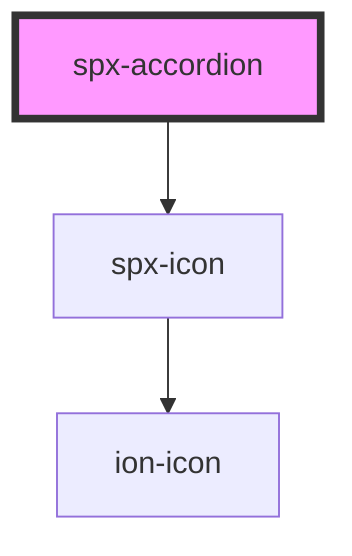

# spx-accordion

<!-- Auto Generated Below -->

## Properties

| Property                          | Attribute                            | Description                                                                                | Type      | Default                       |
| --------------------------------- | ------------------------------------ | ------------------------------------------------------------------------------------------ | --------- | ----------------------------- |
| `contentColor`                    | `content-color`                      |                                                                                            | `string`  | `'var(--spx-color-gray-900)'` |
| `contentText`                     | `content-text`                       | Content text.                                                                              | `string`  | `'Default Content Text'`      |
| `contentTextTag`                  | `content-text-tag`                   | Content text tag.                                                                          | `string`  | `'span'`                      |
| `contentTransitionDuration`       | `content-transition-duration`        |                                                                                            | `string`  | `s.transitionDuration`        |
| `contentTransitionTimingFunction` | `content-transition-timing-function` |                                                                                            | `string`  | `s.transitionTimingFunction`  |
| `disableAnimation`                | `disable-animation`                  | Disables the animation. Set this attribute if the accordion is starting hidden in the DOM. | `boolean` | `undefined`                   |
| `fontSize`                        | `font-size`                          |                                                                                            | `string`  | `s.fontSize`                  |
| `gap`                             | `gap`                                | Space between header and content.                                                          | `string`  | `'0.4em'`                     |
| `headerColor`                     | `header-color`                       |                                                                                            | `string`  | `'var(--spx-color-gray-900)'` |
| `headerGap`                       | `header-gap`                         | Gap between header text and icon.                                                          | `string`  | `'0.4em'`                     |
| `headerText`                      | `header-text`                        | Header text.                                                                               | `string`  | `'Default Header Text'`       |
| `headerTextOpen`                  | `header-text-open`                   | Header text when component is closed.                                                      | `string`  | `undefined`                   |
| `headerTextTag`                   | `header-text-tag`                    | Header text tag.                                                                           | `string`  | `'span'`                      |
| `indicatorIcon`                   | `indicator-icon`                     | Indicator icon.                                                                            | `string`  | `'arrow-down'`                |
| `indicatorIconTransform`          | `indicator-icon-transform`           | Indicator icon transform.                                                                  | `string`  | `'rotate(180deg)'`            |
| `indicatorIconType`               | `indicator-icon-type`                | Indicator icon type.                                                                       | `string`  | `'ionicons'`                  |
| `link`                            | `link`                               | Sets the ID to link different accordions together.                                         | `string`  | `undefined`                   |
| `linkType`                        | `link-type`                          | Sets the type of link.                                                                     | `string`  | `undefined`                   |
| `openState`                       | `open`                               | State of accordion.                                                                        | `boolean` | `false`                       |
| `reverse`                         | `reverse`                            | Reverse icon positioning.                                                                  | `boolean` | `undefined`                   |

## Events

| Event                 | Description                       | Type               |
| --------------------- | --------------------------------- | ------------------ |
| `spxAccordionDidLoad` | Fires after component has loaded. | `CustomEvent<any>` |

## Methods

### `close() => Promise<void>`

Closes the accordion.

#### Returns

Type: `Promise<void>`

### `open() => Promise<void>`

Opens the accordion.

#### Returns

Type: `Promise<void>`

### `reload() => Promise<void>`

#### Returns

Type: `Promise<void>`

### `toggle() => Promise<void>`

Toggles the accordion.

#### Returns

Type: `Promise<void>`

## Slots

| Slot        | Description           |
| ----------- | --------------------- |
| `"content"` | Slot for the content. |
| `"header"`  | Slot for the header.  |

## Dependencies

### Depends on

- [spx-icon](../spx-icon)

### Graph

----------------------------------------------

*Built with [StencilJS](https://stenciljs.com/)*
