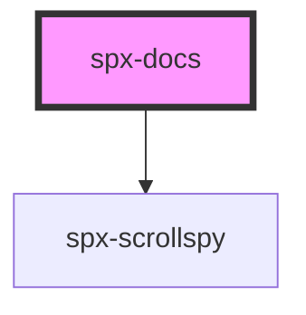

# spx-docs

<!-- Auto Generated Below -->

## Properties

| Property                         | Attribute                            | Description                                                   | Type      | Default       |
| -------------------------------- | ------------------------------------ | ------------------------------------------------------------- | --------- | ------------- |
| `bpMobile`                       | `bp-mobile`                          |                                                               | `number`  | `1024`        |
| `contentPadding`                 | `content-padding`                    |                                                               | `string`  | `undefined`   |
| `contentPaddingYMax`             | `content-padding-y-max`              |                                                               | `number`  | `0`           |
| `contentPaddingYMin`             | `content-padding-y-min`              |                                                               | `number`  | `0`           |
| `gap`                            | `gap`                                |                                                               | `string`  | `'3em'`       |
| `navigationBackground`           | `navigation-background`              |                                                               | `string`  | `undefined`   |
| `navigationGap`                  | `navigation-gap`                     |                                                               | `string`  | `undefined`   |
| `navigationGapMax`               | `navigation-gap-max`                 |                                                               | `number`  | `0.4`         |
| `navigationGapMin`               | `navigation-gap-min`                 |                                                               | `number`  | `0.2`         |
| `navigationHeadingTag`           | `navigation-heading-tag`             |                                                               | `string`  | `'h1'`        |
| `navigationHeightAdjust`         | `navigation-height-adjust`           |                                                               | `string`  | `undefined`   |
| `navigationLinkColor`            | `navigation-link-color`              |                                                               | `string`  | `undefined`   |
| `navigationLinkColorActive`      | `navigation-link-color-active`       |                                                               | `string`  | `undefined`   |
| `navigationLinkFontSize`         | `navigation-link-font-size`          |                                                               | `any`     | `undefined`   |
| `navigationLinkFontSizeMax`      | `navigation-link-font-size-max`      |                                                               | `number`  | `1`           |
| `navigationLinkFontSizeMin`      | `navigation-link-font-size-min`      |                                                               | `number`  | `0.8`         |
| `navigationLinkFontWeight`       | `navigation-link-font-weight`        |                                                               | `string`  | `'500'`       |
| `navigationLinkLetterSpacing`    | `navigation-link-letter-spacing`     |                                                               | `string`  | `'0'`         |
| `navigationLinkLineHeight`       | `navigation-link-line-height`        |                                                               | `string`  | `'1.25'`      |
| `navigationLinkTextTransform`    | `navigation-link-text-transform`     |                                                               | `string`  | `'default'`   |
| `navigationPaddingY`             | `navigation-padding-y`               |                                                               | `string`  | `undefined`   |
| `navigationPaddingYMax`          | `navigation-padding-y-max`           |                                                               | `number`  | `0`           |
| `navigationPaddingYMin`          | `navigation-padding-y-min`           |                                                               | `number`  | `0`           |
| `navigationTitleColor`           | `navigation-title-color`             |                                                               | `string`  | `undefined`   |
| `navigationTitleFontSize`        | `navigation-title-font-size`         |                                                               | `any`     | `undefined`   |
| `navigationTitleFontSizeMax`     | `navigation-title-font-size-max`     |                                                               | `number`  | `0.9`         |
| `navigationTitleFontSizeMin`     | `navigation-title-font-size-min`     |                                                               | `number`  | `0.8`         |
| `navigationTitleFontWeight`      | `navigation-title-font-weight`       |                                                               | `string`  | `'500'`       |
| `navigationTitleLetterSpacing`   | `navigation-title-letter-spacing`    |                                                               | `string`  | `'0'`         |
| `navigationTitleLineHeight`      | `navigation-title-line-height`       |                                                               | `string`  | `'1.25'`      |
| `navigationTitleMarginBottom`    | `navigation-title-margin-bottom`     |                                                               | `number`  | `1`           |
| `navigationTitleMarginBottomMax` | `navigation-title-margin-bottom-max` |                                                               | `number`  | `2`           |
| `navigationTitleMarginBottomMin` | `navigation-title-margin-bottom-min` |                                                               | `number`  | `1`           |
| `navigationTitleTextTransform`   | `navigation-title-text-transform`    |                                                               | `string`  | `'uppercase'` |
| `navigationTop`                  | `navigation-top`                     |                                                               | `string`  | `'0'`         |
| `offsetMarginTop`                | `offset-margin-top`                  |                                                               | `string`  | `''`          |
| `scrolling`                      | `scrolling`                          | Activates automatic navigation scrolling and sets the offset. | `number`  | `undefined`   |
| `separator`                      | `separator`                          | Create a separator between sections.                          | `string`  | `undefined`   |
| `styling`                        | `styling`                            | Styling.                                                      | `string`  | `'fluid'`     |
| `uniqueId`                       | `unique-id`                          |                                                               | `boolean` | `undefined`   |

## Events

| Event            | Description                       | Type               |
| ---------------- | --------------------------------- | ------------------ |
| `spxDocsDidLoad` | Fires after component has loaded. | `CustomEvent<any>` |

## Slots

| Slot      | Description               |
| --------- | ------------------------- |
| `"inner"` | Slot (between HTML tags). |

## Dependencies

### Depends on

- [spx-scrollspy](../spx-scrollspy)

### Graph

----------------------------------------------

*Built with [StencilJS](https://stenciljs.com/)*
