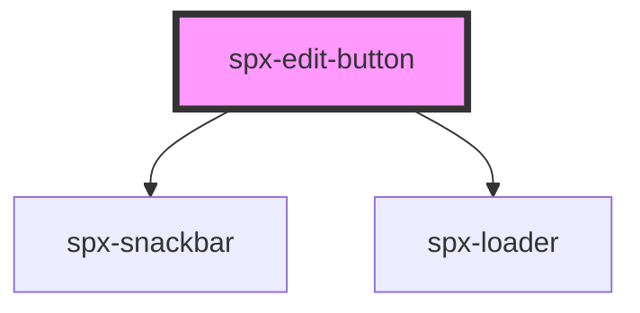

# spx-edit-button

<!-- Auto Generated Below -->

## Properties

| Property            | Attribute            | Description | Type      | Default                       |
| ------------------- | -------------------- | ----------- | --------- | ----------------------------- |
| `background`        | `background`         |             | `string`  | `constants.stylePrimary900`   |
| `backgroundDiscard` | `background-discard` |             | `string`  | `constants.stylePrimary600`   |
| `border`            | `border`             |             | `string`  | `undefined`                   |
| `borderRadius`      | `border-radius`      |             | `string`  | `constants.styleBorderRadius` |
| `color`             | `color`              |             | `string`  | `'#ffffff'`                   |
| `colorDiscard`      | `color-discard`      |             | `string`  | `'#ffffff'`                   |
| `distanceX`         | `distance-x`         |             | `string`  | `'1em'`                       |
| `distanceY`         | `distance-y`         |             | `string`  | `'1em'`                       |
| `editId`            | `edit-id`            |             | `string`  | `undefined`                   |
| `fontSize`          | `font-size`          |             | `string`  | `constants.styleFontSize`     |
| `gap`               | `gap`                |             | `string`  | `'0.4em'`                     |
| `padding`           | `padding`            |             | `string`  | `'0.8em 1.2em'`               |
| `position`          | `position`           |             | `string`  | `'bottom-center'`             |
| `styling`           | `styling`            |             | `string`  | `undefined`                   |
| `test`              | `test`               |             | `boolean` | `false`                       |
| `textDiscard`       | `text-discard`       |             | `string`  | `'Discard'`                   |
| `textEdit`          | `text-edit`          |             | `string`  | `'Edit site'`                 |
| `textSave`          | `text-save`          |             | `string`  | `'Save'`                      |
| `textSuccess`       | `text-success`       |             | `string`  | `'Save was successful.'`      |
| `type`              | `type`               |             | `string`  | `'option'`                    |

## Events

| Event                  | Description | Type               |
| ---------------------- | ----------- | ------------------ |
| `spxEditButtonDiscard` |             | `CustomEvent<any>` |
| `spxEditButtonSave`    |             | `CustomEvent<any>` |

## Dependencies

### Depends on

- [spx-snackbar](../spx-snackbar)
- [spx-loader](../spx-loader)

### Graph

----------------------------------------------

*Built with [StencilJS](https://stenciljs.com/)*
