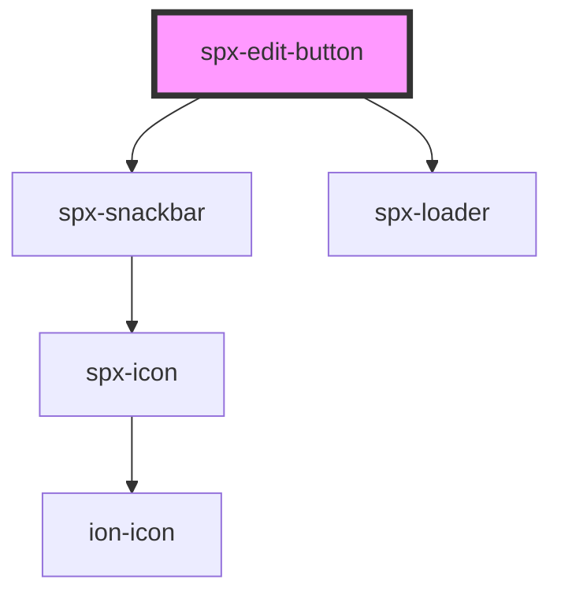

# spx-edit-button

<!-- Auto Generated Below -->

## Properties

| Property            | Attribute            | Description                                                                                                                                                                                                    | Type                                              | Default                       |
| ------------------- | -------------------- | -------------------------------------------------------------------------------------------------------------------------------------------------------------------------------------------------------------- | ------------------------------------------------- | ----------------------------- |
| `background`        | `background`         |                                                                                                                                                                                                                | `string`                                          | `'var(--spx-color-gray-900)'` |
| `backgroundDiscard` | `background-discard` | Discard button background.                                                                                                                                                                                     | `string`                                          | `'var(--spx-color-gray-600)'` |
| `border`            | `border`             |                                                                                                                                                                                                                | `string`                                          | `'none'`                      |
| `borderRadius`      | `border-radius`      |                                                                                                                                                                                                                | `string`                                          | `c.borderRadius`              |
| `color`             | `color`              |                                                                                                                                                                                                                | `string`                                          | `'#ffffff'`                   |
| `colorDiscard`      | `color-discard`      | Discard button color.                                                                                                                                                                                          | `string`                                          | `'#ffffff'`                   |
| `distanceX`         | `distance-x`         | Distance to the edge of the viewport on the x-axis.                                                                                                                                                            | `string`                                          | `'1em'`                       |
| `distanceY`         | `distance-y`         | Distance to the edge of the viewport on the y-axis.                                                                                                                                                            | `string`                                          | `'1em'`                       |
| `editId`            | `edit-id`            | Corresponding ID for editable fields. This property is needed when multiple edit-button components are used on the page. Simply apply a "data-spx-edit-id" attribute with the same value to editable elements. | `string`                                          | `undefined`                   |
| `fontFamily`        | `font-family`        |                                                                                                                                                                                                                | `string`                                          | `c.fontFamily`                |
| `fontSize`          | `font-size`          |                                                                                                                                                                                                                | `string`                                          | `c.fontSize`                  |
| `gap`               | `gap`                | Gap between the buttons.                                                                                                                                                                                       | `string`                                          | `'0.4em'`                     |
| `padding`           | `padding`            |                                                                                                                                                                                                                | `string`                                          | `'0.8em 1.2em'`               |
| `position`          | `position`           | Component position in page.                                                                                                                                                                                    | `string`                                          | `'bottom-right'`              |
| `positionCss`       | `position-css`       | CSS property position of button.                                                                                                                                                                               | `"absolute" \| "fixed" \| "relative" \| "static"` | `'fixed'`                     |
| `test`              | `test`               |                                                                                                                                                                                                                | `boolean`                                         | `false`                       |
| `textDiscard`       | `text-discard`       | Discard button text.                                                                                                                                                                                           | `string`                                          | `'Discard'`                   |
| `textEdit`          | `text-edit`          | Edit button text.                                                                                                                                                                                              | `string`                                          | `'Edit site'`                 |
| `textSave`          | `text-save`          | Save button text.                                                                                                                                                                                              | `string`                                          | `'Save'`                      |
| `textSuccess`       | `text-success`       | Success message.                                                                                                                                                                                               | `string`                                          | `'Save was successful'`       |
| `type`              | `type`               | Type of data being sent.                                                                                                                                                                                       | `string`                                          | `'option'`                    |
| `zIndex`            | `z-index`            |                                                                                                                                                                                                                | `number`                                          | `99`                          |

## Events

| Event                  | Description                              | Type               |
| ---------------------- | ---------------------------------------- | ------------------ |
| `spxEditButtonDiscard` | Fires after pressing the discard button. | `CustomEvent<any>` |
| `spxEditButtonSave`    | Fires after pressing the save button.    | `CustomEvent<any>` |

## Methods

### `reload() => Promise<void>`

#### Returns

Type: `Promise<void>`

## Dependencies

### Depends on

- [spx-snackbar](../spx-snackbar)
- [spx-loader](../spx-loader)

### Graph

----------------------------------------------

*Built with [StencilJS](https://stenciljs.com/)*
