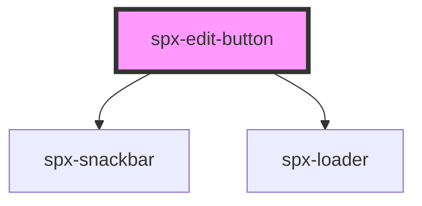

# spx-edit-button

<!-- Auto Generated Below -->

## Properties

| Property            | Attribute            | Description | Type     | Default                              |
| ------------------- | -------------------- | ----------- | -------- | ------------------------------------ |
| `background`        | `background`         |             | `string` | `constants.styleBackground`          |
| `backgroundDiscard` | `background-discard` |             | `string` | `constants.styleBackgroundSecondary` |
| `borderRadius`      | `border-radius`      |             | `string` | `constants.styleBorderRadius`        |
| `bottom`            | `bottom`             |             | `string` | `'12px'`                             |
| `color`             | `color`              |             | `string` | `constants.styleColor`               |
| `colorDiscard`      | `color-discard`      |             | `string` | `constants.styleColor`               |
| `fontSize`          | `font-size`          |             | `string` | `'16px'`                             |
| `gap`               | `gap`                |             | `string` | `'8px'`                              |
| `left`              | `left`               |             | `string` | `undefined`                          |
| `padding`           | `padding`            |             | `string` | `'12px 24px'`                        |
| `position`          | `position`           |             | `string` | `'fixed'`                            |
| `right`             | `right`              |             | `string` | `'12px'`                             |
| `styling`           | `styling`            |             | `string` | `undefined`                          |
| `textDiscard`       | `text-discard`       |             | `string` | `'Discard'`                          |
| `textEdit`          | `text-edit`          |             | `string` | `'Edit site'`                        |
| `textSave`          | `text-save`          |             | `string` | `'Save'`                             |
| `textSuccess`       | `text-success`       |             | `string` | `'Save was successful.'`             |
| `top`               | `top`                |             | `string` | `undefined`                          |
| `zIndex`            | `z-index`            |             | `number` | `999999`                             |

## Events

| Event                   | Description | Type               |
| ----------------------- | ----------- | ------------------ |
| `spxEditDiscardChanges` |             | `CustomEvent<any>` |
| `spxEditSaveChanges`    |             | `CustomEvent<any>` |

## Dependencies

### Depends on

- [spx-snackbar](../spx-snackbar)
- [spx-loader](../spx-loader)

### Graph

----------------------------------------------

*Built with [StencilJS](https://stenciljs.com/)*
