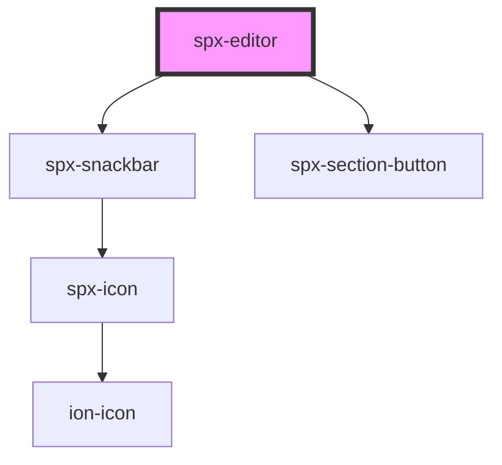

# spx-editor

<!-- Auto Generated Below -->

## Properties

| Property     | Attribute    | Description | Type      | Default     |
| ------------ | ------------ | ----------- | --------- | ----------- |
| `fullscreen` | `fullscreen` |             | `boolean` | `false`     |
| `location`   | `location`   |             | `string`  | `undefined` |

## Dependencies

### Depends on

- [spx-snackbar](../spx-snackbar)
- [spx-section-button](../spx-section)

### Graph

----------------------------------------------

*Built with [StencilJS](https://stenciljs.com/)*
