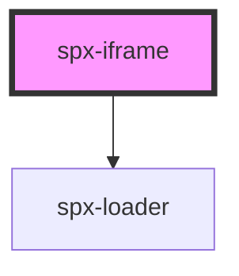

# spx-iframe

<!-- Auto Generated Below -->

## Properties

| Property               | Attribute                | Description                                      | Type      | Default             |
| ---------------------- | ------------------------ | ------------------------------------------------ | --------- | ------------------- |
| `display`              | `display`                |                                                  | `string`  | `'block'`           |
| `documentBorder`       | `document-border`        |                                                  | `string`  | `'none'`            |
| `documentBorderRadius` | `document-border-radius` |                                                  | `string`  | `'none'`            |
| `documentHeight`       | `document-height`        |                                                  | `string`  | `'auto'`            |
| `documentWidth`        | `document-width`         |                                                  | `string`  | `'100%'`            |
| `fit`                  | `fit`                    | Automatically resize iframe to fit content.      | `boolean` | `undefined`         |
| `lazy`                 | `lazy`                   | Lazy load content.                               | `boolean` | `undefined`         |
| `size`                 | `size`                   | Screen size of the site shown inside the iframe. | `string`  | `'1440px'`          |
| `src`                  | `src`                    | Source for the iframe.                           | `string`  | `'https://spx.dev'` |
| `type`                 | `type`                   | Screen size of the site shown inside the iframe. | `string`  | `'resize'`          |

## Events

| Event              | Description                       | Type               |
| ------------------ | --------------------------------- | ------------------ |
| `spxIframeDidLoad` | Fires after component has loaded. | `CustomEvent<any>` |

## Methods

### `reload() => Promise<void>`

#### Returns

Type: `Promise<void>`

## Dependencies

### Depends on

- [spx-loader](../spx-loader)

### Graph

----------------------------------------------

*Built with [StencilJS](https://stenciljs.com/)*
