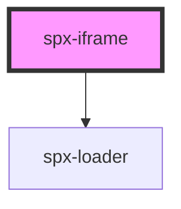

# spx-iframe

<!-- Auto Generated Below -->

## Properties

| Property | Attribute | Description | Type     | Default     |
| -------- | --------- | ----------- | -------- | ----------- |
| `size`   | `size`    |             | `string` | `'1440px'`  |
| `src`    | `src`     |             | `string` | `undefined` |

## Dependencies

### Depends on

- [spx-loader](../spx-loader)

### Graph

----------------------------------------------

*Built with [StencilJS](https://stenciljs.com/)*
