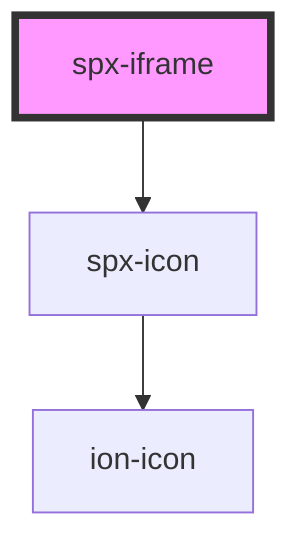

# spx-iframe

<!-- Auto Generated Below -->

## Properties

| Property               | Attribute                | Description                                      | Type      | Default                       |
| ---------------------- | ------------------------ | ------------------------------------------------ | --------- | ----------------------------- |
| `display`              | `display`                |                                                  | `string`  | `s.display`                   |
| `documentBorder`       | `document-border`        |                                                  | `string`  | `'none'`                      |
| `documentBorderRadius` | `document-border-radius` |                                                  | `string`  | `'none'`                      |
| `documentHeight`       | `document-height`        |                                                  | `string`  | `'auto'`                      |
| `documentWidth`        | `document-width`         |                                                  | `string`  | `'100%'`                      |
| `fit`                  | `fit`                    | Automatically resize iframe to fit content.      | `boolean` | `undefined`                   |
| `lazy`                 | `lazy`                   | Lazy load content.                               | `boolean` | `undefined`                   |
| `loaderBackground`     | `loader-background`      |                                                  | `string`  | `'var(--spx-color-gray-900)'` |
| `loaderBorderRadius`   | `loader-border-radius`   |                                                  | `string`  | `s.borderRadius`              |
| `loaderColor`          | `loader-color`           |                                                  | `string`  | `'#ffffff'`                   |
| `minHeight`            | `min-height`             |                                                  | `string`  | `'400px'`                     |
| `size`                 | `size`                   | Screen size of the site shown inside the iframe. | `string`  | `'1440px'`                    |
| `src`                  | `src`                    | Source for the iframe.                           | `string`  | `'https://spx.dev'`           |
| `type`                 | `type`                   | Screen size of the site shown inside the iframe. | `string`  | `'resize'`                    |

## Events

| Event              | Description                       | Type               |
| ------------------ | --------------------------------- | ------------------ |
| `spxIframeDidLoad` | Fires after component has loaded. | `CustomEvent<any>` |

## Slots

| Slot      | Description               |
| --------- | ------------------------- |
| `"inner"` | Slot (between HTML tags). |

## Dependencies

### Depends on

- [spx-icon](../spx-icon)

### Graph

----------------------------------------------

*Built with [StencilJS](https://stenciljs.com/)*
