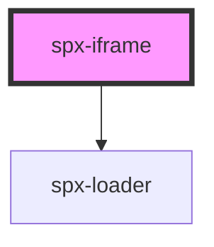

# spx-iframe

<!-- Auto Generated Below -->

## Properties

| Property | Attribute | Description                                      | Type     | Default             |
| -------- | --------- | ------------------------------------------------ | -------- | ------------------- |
| `size`   | `size`    | Screen size of the site shown inside the iframe. | `string` | `'1440px'`          |
| `src`    | `src`     | Source for the iframe.                           | `string` | `'https://spx.dev'` |

## Methods

### `reload() => Promise<void>`

#### Returns

Type: `Promise<void>`

## Dependencies

### Depends on

- [spx-loader](../spx-loader)

### Graph

----------------------------------------------

*Built with [StencilJS](https://stenciljs.com/)*
