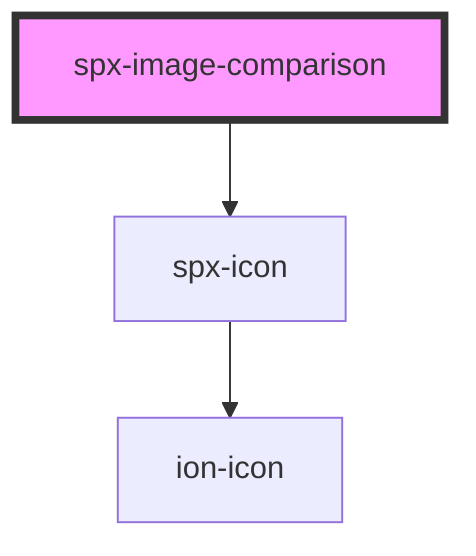

# spx-image-comparison

<!-- Auto Generated Below -->

## Properties

| Property    | Attribute    | Description                    | Type     | Default                                         |
| ----------- | ------------ | ------------------------------ | -------- | ----------------------------------------------- |
| `color`     | `color`      |                                | `string` | `'#ffffff'`                                     |
| `height`    | `height`     |                                | `string` | `'100%'`                                        |
| `iconColor` | `icon-color` |                                | `string` | `'var(--spx-color-gray-900)'`                   |
| `srcAfter`  | `src-after`  | Image URL of the before image. | `string` | `'https://source.unsplash.com/random/1200x300'` |
| `srcBefore` | `src-before` | Image URL of the after image.  | `string` | `'https://source.unsplash.com/random/1201x300'` |
| `start`     | `start`      | Opening state in pixels.       | `number` | `150`                                           |

## Events

| Event                       | Description                       | Type               |
| --------------------------- | --------------------------------- | ------------------ |
| `spxImageComparisonDidLoad` | Fires after component has loaded. | `CustomEvent<any>` |

## Methods

### `reload() => Promise<void>`

#### Returns

Type: `Promise<void>`

## Dependencies

### Depends on

- [spx-icon](../spx-icon)

### Graph

----------------------------------------------

*Built with [StencilJS](https://stenciljs.com/)*
