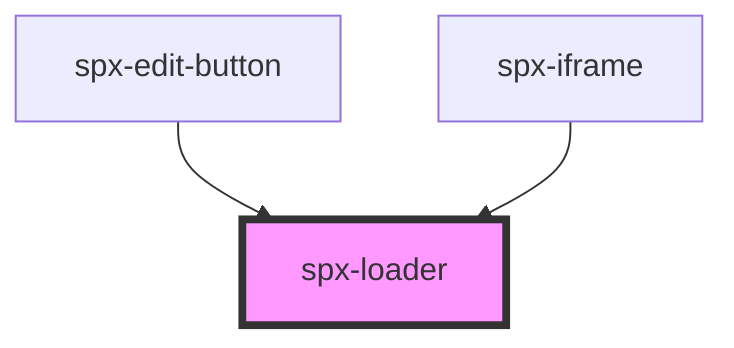

# spx-loader

<!-- Auto Generated Below -->

## Properties

| Property | Attribute | Description | Type     | Default     |
| -------- | --------- | ----------- | -------- | ----------- |
| `color`  | `color`   |             | `string` | `'#ffffff'` |
| `speed`  | `speed`   |             | `string` | `'1.5s'`    |

## Dependencies

### Used by

 - [spx-edit-button](../spx-edit-button)
 - [spx-iframe](../spx-iframe)

### Graph

----------------------------------------------

*Built with [StencilJS](https://stenciljs.com/)*
