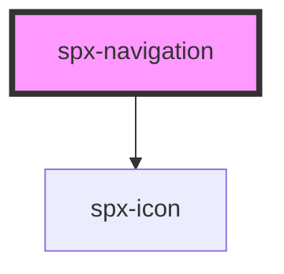

# harmoni-tooltip

<!-- Auto Generated Below -->

## Properties

| Property            | Attribute             | Description | Type     | Default                       |
| ------------------- | --------------------- | ----------- | -------- | ----------------------------- |
| `childBorderRadius` | `child-border-radius` |             | `string` | `constants.styleBorderRadius` |
| `childGap`          | `child-gap`           |             | `string` | `'12px'`                      |
| `childIndicatorGap` | `child-indicator-gap` |             | `string` | `'4px'`                       |
| `childItemGap`      | `child-item-gap`      |             | `string` | `'12px'`                      |
| `childPadding`      | `child-padding`       |             | `string` | `'12px'`                      |
| `iconChild`         | `icon-child`          |             | `string` | `undefined`                   |
| `linkColor`         | `link-color`          |             | `string` | `'#202020'`                   |
| `menu`              | `menu`                |             | `string` | `undefined`                   |
| `mobile`            | `mobile`              |             | `number` | `undefined`                   |
| `parentItemGap`     | `parent-item-gap`     |             | `string` | `'24px'`                      |
| `styling`           | `styling`             |             | `string` | `undefined`                   |

## Dependencies

### Depends on

- [spx-icon](../spx-icon)

### Graph

----------------------------------------------

*Built with [StencilJS](https://stenciljs.com/)*
