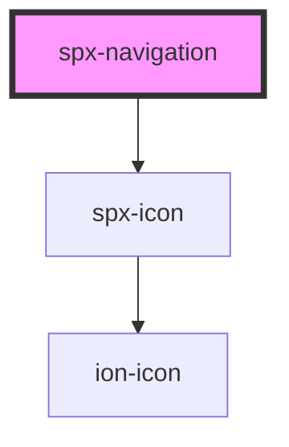

# spx-navigation

<!-- Auto Generated Below -->

## Properties

| Property                       | Attribute                         | Description                                       | Type      | Default                                 |
| ------------------------------ | --------------------------------- | ------------------------------------------------- | --------- | --------------------------------------- |
| `childBorder`                  | `child-border`                    |                                                   | `string`  | `'1px solid var(--spx-color-gray-200)'` |
| `childBorderRadius`            | `child-border-radius`             | Child menu border-radius.                         | `string`  | `s.borderRadius`                        |
| `childBoxShadow`               | `child-box-shadow`                | Child menu box-shadow.                            | `string`  | `'0 3px 10px 0 rgba(0,0,0,0.05)'`       |
| `childChildGap`                | `child-child-gap`                 | Gap between nested child menus.                   | `string`  | `'0.8em'`                               |
| `childGap`                     | `child-gap`                       | Gap between top level menu items and child menus. | `string`  | `'0.5em'`                               |
| `childIcon`                    | `child-icon`                      | Indicator icon.                                   | `string`  | `'arrow-down'`                          |
| `childIconType`                | `child-icon-type`                 | Indicator icon type.                              | `string`  | `'ionicons'`                            |
| `childIndicatorGap`            | `child-indicator-gap`             | Gap between child menu indicator and text.        | `string`  | `'0.2em'`                               |
| `childItemBackground`          | `child-item-background`           |                                                   | `string`  | `'#ffffff'`                             |
| `childItemBackgroundHover`     | `child-item-background-hover`     |                                                   | `string`  | `'var(--spx-color-gray-100)'`           |
| `childItemColor`               | `child-item-color`                |                                                   | `string`  | `'var(--spx-color-gray-700)'`           |
| `childItemColorHover`          | `child-item-color-hover`          |                                                   | `string`  | `'var(--spx-color-gray-900)'`           |
| `childItemPadding`             | `child-item-padding`              |                                                   | `string`  | `'0.6em 0.8em'`                         |
| `childPlacement`               | `child-placement`                 | Child menu placement.                             | `string`  | `'start'`                               |
| `fontSize`                     | `font-size`                       |                                                   | `string`  | `'clamp(18px, 1.6vw, 20px)'`            |
| `itemTransitionDuration`       | `item-transition-duration`        |                                                   | `string`  | `s.transitionDuration`                  |
| `itemTransitionTimingFunction` | `item-transition-timing-function` |                                                   | `string`  | `s.transitionTimingFunction`            |
| `itemUnderline`                | `item-underline`                  | Underlines all links.                             | `boolean` | `undefined`                             |
| `itemUnderlineHover`           | `item-underline-hover`            | Underlines all links on hover.                    | `boolean` | `undefined`                             |
| `menu`                         | `menu`                            | Renders a WordPress menu.                         | `string`  | `undefined`                             |
| `mobile`                       | `mobile`                          | Mobile breakpoint.                                | `number`  | `s.bpMobileWidth`                       |
| `mobileIcon`                   | `mobile-icon`                     | Mobile button icon.                               | `string`  | `undefined`                             |
| `mobileIconType`               | `mobile-icon-type`                | Mobile button icon type.                          | `string`  | `'ionicons'`                            |
| `mobileItemBackground`         | `mobile-item-background`          |                                                   | `string`  | `'#ffffff'`                             |
| `mobileItemBackgroundHover`    | `mobile-item-background-hover`    |                                                   | `string`  | `'var(--spx-color-gray-100)'`           |
| `mobileItemColor`              | `mobile-item-color`               |                                                   | `string`  | `'var(--spx-color-gray-800)'`           |
| `mobileItemColorHover`         | `mobile-item-color-hover`         |                                                   | `string`  | `'var(--spx-color-gray-900)'`           |
| `mobileItemNestedMarginLeft`   | `mobile-item-nested-margin-left`  |                                                   | `string`  | `'0.8em'`                               |
| `mobileItemPadding`            | `mobile-item-padding`             |                                                   | `string`  | `'0.6em'`                               |
| `mobilePlacement`              | `mobile-placement`                | Mobile placement.                                 | `string`  | `'start'`                               |
| `parentItemBackground`         | `parent-item-background`          |                                                   | `string`  | `'#ffffff'`                             |
| `parentItemBackgroundHover`    | `parent-item-background-hover`    |                                                   | `string`  | `'var(--spx-color-gray-100)'`           |
| `parentItemColor`              | `parent-item-color`               |                                                   | `string`  | `'var(--spx-color-gray-800)'`           |
| `parentItemColorHover`         | `parent-item-color-hover`         |                                                   | `string`  | `'var(--spx-color-gray-900)'`           |
| `parentItemGap`                | `parent-item-gap`                 | Gap between parent menu items.                    | `string`  | `'0.4em'`                               |
| `parentItemPadding`            | `parent-item-padding`             |                                                   | `string`  | `'0.6em'`                               |
| `vertical`                     | `vertical`                        | Renders menu vertically.                          | `boolean` | `undefined`                             |

## Events

| Event                  | Description                       | Type               |
| ---------------------- | --------------------------------- | ------------------ |
| `spxNavigationDidLoad` | Fires after component has loaded. | `CustomEvent<any>` |

## Methods

### `reload() => Promise<void>`

#### Returns

Type: `Promise<void>`

## Dependencies

### Depends on

- [spx-icon](../spx-icon)

### Graph

----------------------------------------------

*Built with [StencilJS](https://stenciljs.com/)*
