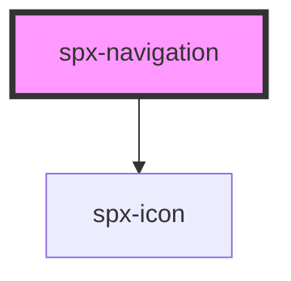

# harmoni-tooltip

<!-- Auto Generated Below -->

## Properties

| Property                    | Attribute                      | Description | Type      | Default                                         |
| --------------------------- | ------------------------------ | ----------- | --------- | ----------------------------------------------- |
| `childBorder`               | `child-border`                 |             | `string`  | `'1px solid ' + constants.stylePrimary300 + ''` |
| `childChildGap`             | `child-child-gap`              |             | `string`  | `'0.8em'`                                       |
| `childGap`                  | `child-gap`                    |             | `string`  | `'0.5em'`                                       |
| `childIndicatorGap`         | `child-indicator-gap`          |             | `string`  | `'0.2em'`                                       |
| `childItemBackground`       | `child-item-background`        |             | `string`  | `'#ffffff'`                                     |
| `childItemBackgroundHover`  | `child-item-background-hover`  |             | `string`  | `constants.stylePrimary100`                     |
| `childItemColor`            | `child-item-color`             |             | `string`  | `constants.stylePrimary700`                     |
| `childItemColorHover`       | `child-item-color-hover`       |             | `string`  | `constants.stylePrimary900`                     |
| `childItemMarginLeft`       | `child-item-margin-left`       |             | `string`  | `'0.8em'`                                       |
| `childItemPadding`          | `child-item-padding`           |             | `string`  | `'0.6em 0.8em'`                                 |
| `childPlacement`            | `child-placement`              |             | `string`  | `'start'`                                       |
| `fontSize`                  | `font-size`                    |             | `string`  | `constants.styleFontSize`                       |
| `iconChild`                 | `icon-child`                   |             | `string`  | `undefined`                                     |
| `itemUnderline`             | `item-underline`               |             | `boolean` | `undefined`                                     |
| `itemUnderlineHover`        | `item-underline-hover`         |             | `boolean` | `undefined`                                     |
| `menu`                      | `menu`                         |             | `string`  | `undefined`                                     |
| `mobile`                    | `mobile`                       |             | `number`  | `constants.styleMobileBP`                       |
| `mobilePlacement`           | `mobile-placement`             |             | `string`  | `'start'`                                       |
| `parentItemBackground`      | `parent-item-background`       |             | `string`  | `'#ffffff'`                                     |
| `parentItemBackgroundHover` | `parent-item-background-hover` |             | `string`  | `constants.stylePrimary100`                     |
| `parentItemColor`           | `parent-item-color`            |             | `string`  | `constants.stylePrimary800`                     |
| `parentItemColorHover`      | `parent-item-color-hover`      |             | `string`  | `constants.stylePrimary900`                     |
| `parentItemGap`             | `parent-item-gap`              |             | `string`  | `'0.4em'`                                       |
| `parentItemPadding`         | `parent-item-padding`          |             | `string`  | `'0.6em'`                                       |
| `styling`                   | `styling`                      |             | `string`  | `undefined`                                     |
| `vertical`                  | `vertical`                     |             | `boolean` | `undefined`                                     |

## Dependencies

### Depends on

- [spx-icon](../spx-icon)

### Graph

----------------------------------------------

*Built with [StencilJS](https://stenciljs.com/)*
