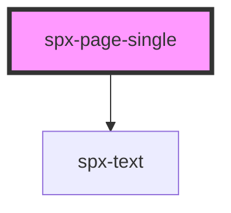

# spx-page-single

<!-- Auto Generated Below -->

## Properties

| Property                 | Attribute                   | Description                      | Type      | Default                                 |
| ------------------------ | --------------------------- | -------------------------------- | --------- | --------------------------------------- |
| `authorColor`            | `author-color`              |                                  | `string`  | `'var(--spx-color-800)'`                |
| `authorFontFamily`       | `author-font-family`        |                                  | `string`  | `state.fontFamilyPrimary`               |
| `authorFontSizeMax`      | `author-font-size-max`      |                                  | `number`  | `1.2`                                   |
| `authorFontSizeMin`      | `author-font-size-min`      |                                  | `number`  | `0.9`                                   |
| `authorFontWeight`       | `author-font-weight`        |                                  | `string`  | `'500'`                                 |
| `authorLetterSpacing`    | `author-letter-spacing`     |                                  | `string`  | `'0'`                                   |
| `authorLineHeight`       | `author-line-height`        |                                  | `string`  | `'1.25'`                                |
| `authorMarginTopMax`     | `author-margin-top-max`     |                                  | `number`  | `2`                                     |
| `authorMarginTopMin`     | `author-margin-top-min`     |                                  | `number`  | `1`                                     |
| `authorTextTransform`    | `author-text-transform`     |                                  | `string`  | `'uppercase'`                           |
| `contentMarginTopMax`    | `content-margin-top-max`    |                                  | `number`  | `4`                                     |
| `contentMarginTopMin`    | `content-margin-top-min`    |                                  | `number`  | `3`                                     |
| `contentMaxWidth`        | `content-max-width`         |                                  | `string`  | `'700px'`                               |
| `contentPaddingX`        | `content-padding-x`         |                                  | `string`  | `'var(--spx-container-padding-x)'`      |
| `date`                   | `date`                      | Display date.                    | `boolean` | `true`                                  |
| `dateColor`              | `date-color`                |                                  | `string`  | `'var(--spx-color-gray-600)'`           |
| `dateFontFamily`         | `date-font-family`          |                                  | `string`  | `state.fontFamilyPrimary`               |
| `dateFontSizeMax`        | `date-font-size-max`        |                                  | `number`  | `0.9`                                   |
| `dateFontSizeMin`        | `date-font-size-min`        |                                  | `number`  | `0.9`                                   |
| `dateFontWeight`         | `date-font-weight`          |                                  | `string`  | `'500'`                                 |
| `dateLetterSpacing`      | `date-letter-spacing`       |                                  | `string`  | `'0'`                                   |
| `dateLineHeight`         | `date-line-height`          |                                  | `string`  | `'1.25'`                                |
| `dateMarginTopMax`       | `date-margin-top-max`       |                                  | `number`  | `2`                                     |
| `dateMarginTopMin`       | `date-margin-top-min`       |                                  | `number`  | `1.5`                                   |
| `dateTextTransform`      | `date-text-transform`       |                                  | `string`  | `'default'`                             |
| `headerBorderBottom`     | `header-border-bottom`      |                                  | `string`  | `'1px solid var(--spx-color-gray-200)'` |
| `headerPaddingBottomMax` | `header-padding-bottom-max` |                                  | `number`  | `2`                                     |
| `headerPaddingBottomMin` | `header-padding-bottom-min` |                                  | `number`  | `1`                                     |
| `image`                  | `image`                     | Display image.                   | `boolean` | `true`                                  |
| `imageBorderRadius`      | `image-border-radius`       |                                  | `string`  | `s.borderRadius`                        |
| `imageHeight`            | `image-height`              |                                  | `string`  | `'clamp(200px, 50vh, 600px)'`           |
| `imageObjectPosition`    | `image-object-position`     |                                  | `string`  | `'50% 50%'`                             |
| `imagePaddingX`          | `image-padding-x`           |                                  | `string`  | `'var(--spx-container-padding-x-sm)'`   |
| `imageSpaceYMax`         | `image-space-y-max`         |                                  | `number`  | `2`                                     |
| `imageSpaceYMin`         | `image-space-y-min`         |                                  | `number`  | `1`                                     |
| `mobile`                 | `mobile`                    | Mobile breakpoint.               | `number`  | `c.bpMobileWidth`                       |
| `post`                   | `post`                      | Gets a WordPress post to render. | `string`  | `undefined`                             |
| `titleColor`             | `title-color`               | Space to edge of the viewport.   | `string`  | `'var(--spx-color-800)'`                |
| `titleFontFamily`        | `title-font-family`         |                                  | `string`  | `state.fontFamilyPrimary`               |
| `titleFontSizeMax`       | `title-font-size-max`       |                                  | `number`  | `4`                                     |
| `titleFontSizeMin`       | `title-font-size-min`       |                                  | `number`  | `2.7`                                   |
| `titleFontWeight`        | `title-font-weight`         |                                  | `string`  | `'500'`                                 |
| `titleLetterSpacing`     | `title-letter-spacing`      |                                  | `string`  | `'0'`                                   |
| `titleLineHeight`        | `title-line-height`         |                                  | `string`  | `'1.25'`                                |
| `titleMarginTopMax`      | `title-margin-top-max`      |                                  | `number`  | `2`                                     |
| `titleMarginTopMin`      | `title-margin-top-min`      |                                  | `number`  | `1`                                     |
| `titleTextTransform`     | `title-text-transform`      |                                  | `string`  | `'default'`                             |

## Events

| Event                  | Description                       | Type               |
| ---------------------- | --------------------------------- | ------------------ |
| `spxPageSingleDidLoad` | Fires after component has loaded. | `CustomEvent<any>` |

## Dependencies

### Depends on

- [spx-text](../spx-text)

### Graph

----------------------------------------------

*Built with [StencilJS](https://stenciljs.com/)*
