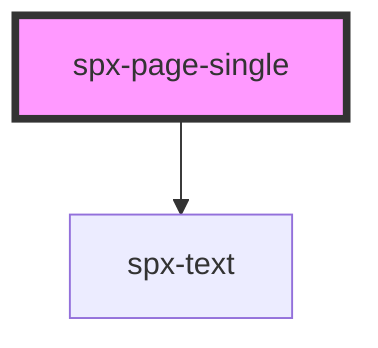

# spx-page-single

<!-- Auto Generated Below -->

## Properties

| Property                   | Attribute                     | Description                      | Type      | Default                                 |
| -------------------------- | ----------------------------- | -------------------------------- | --------- | --------------------------------------- |
| `authorColor`              | `author-color`                |                                  | `string`  | `'var(--spx-color-800)'`                |
| `authorFontFamily`         | `author-font-family`          |                                  | `string`  | `state.fontFamilyPrimary`               |
| `authorFontSizeMultiplier` | `author-font-size-multiplier` |                                  | `number`  | `1`                                     |
| `authorFontWeight`         | `author-font-weight`          |                                  | `string`  | `'500'`                                 |
| `authorLetterSpacing`      | `author-letter-spacing`       |                                  | `string`  | `'0'`                                   |
| `authorLineHeight`         | `author-line-height`          |                                  | `string`  | `'1.25'`                                |
| `authorMarginTop`          | `author-margin-top`           |                                  | `string`  | `'var(--spx-space-lg)'`                 |
| `authorTextTransform`      | `author-text-transform`       |                                  | `string`  | `'uppercase'`                           |
| `contentMarginTop`         | `content-margin-top`          |                                  | `string`  | `'var(--spx-space-xl)'`                 |
| `contentMaxWidth`          | `content-max-width`           |                                  | `string`  | `'700px'`                               |
| `date`                     | `date`                        | Display date.                    | `boolean` | `true`                                  |
| `dateColor`                | `date-color`                  |                                  | `string`  | `'var(--spx-color-gray-600)'`           |
| `dateFontFamily`           | `date-font-family`            |                                  | `string`  | `state.fontFamilyPrimary`               |
| `dateFontSizeMultiplier`   | `date-font-size-multiplier`   |                                  | `number`  | `1`                                     |
| `dateFontWeight`           | `date-font-weight`            |                                  | `string`  | `'500'`                                 |
| `dateLetterSpacing`        | `date-letter-spacing`         |                                  | `string`  | `'0'`                                   |
| `dateLineHeight`           | `date-line-height`            |                                  | `string`  | `'1.25'`                                |
| `dateMarginTop`            | `date-margin-top`             |                                  | `string`  | `'var(--spx-space-sm)'`                 |
| `dateTextTransform`        | `date-text-transform`         |                                  | `string`  | `'default'`                             |
| `headerBorderBottom`       | `header-border-bottom`        |                                  | `string`  | `'1px solid var(--spx-color-gray-200)'` |
| `headerPaddingBottom`      | `header-padding-bottom`       |                                  | `string`  | `'var(--spx-space-xl)'`                 |
| `image`                    | `image`                       | Display image.                   | `boolean` | `true`                                  |
| `imageBorderRadius`        | `image-border-radius`         |                                  | `string`  | `c.borderRadius`                        |
| `imageHeight`              | `image-height`                |                                  | `string`  | `'clamp(200px, 50vh, 600px)'`           |
| `imageObjectPosition`      | `image-object-position`       |                                  | `string`  | `'50% 50%'`                             |
| `imageSpaceY`              | `image-space-y`               |                                  | `string`  | `'var(--spx-space-md)'`                 |
| `mobile`                   | `mobile`                      | Mobile breakpoint.               | `number`  | `c.mobileBpWidth`                       |
| `post`                     | `post`                        | Gets a WordPress post to render. | `string`  | `undefined`                             |
| `spaceX`                   | `space-x`                     | Space to edge of the viewport.   | `string`  | `'var(--spx-container-space-x-sm)'`     |
| `titleColor`               | `title-color`                 |                                  | `string`  | `'var(--spx-color-800)'`                |
| `titleFontFamily`          | `title-font-family`           |                                  | `string`  | `state.fontFamilyPrimary`               |
| `titleFontSizeMultiplier`  | `title-font-size-multiplier`  |                                  | `number`  | `1`                                     |
| `titleFontWeight`          | `title-font-weight`           |                                  | `string`  | `'500'`                                 |
| `titleLetterSpacing`       | `title-letter-spacing`        |                                  | `string`  | `'0'`                                   |
| `titleLineHeight`          | `title-line-height`           |                                  | `string`  | `'1.25'`                                |
| `titleMarginTop`           | `title-margin-top`            |                                  | `string`  | `'var(--spx-space-md)'`                 |
| `titleTextTransform`       | `title-text-transform`        |                                  | `string`  | `'default'`                             |

## Dependencies

### Depends on

- [spx-text](../spx-text)

### Graph

----------------------------------------------

*Built with [StencilJS](https://stenciljs.com/)*
