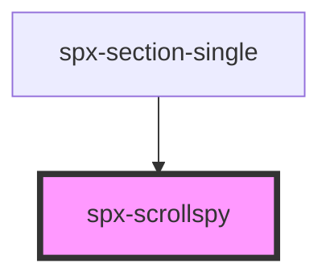

# spx-scrollspy

<!-- Auto Generated Below -->

## Properties

| Property       | Attribute       | Description | Type      | Default                            |
| -------------- | --------------- | ----------- | --------- | ---------------------------------- |
| `contentClass` | `content-class` |             | `string`  | `'spx-scrollspy__content--active'` |
| `navClass`     | `nav-class`     |             | `string`  | `'spx-scrollspy__nav--active'`     |
| `offset`       | `offset`        |             | `any`     | `undefined`                        |
| `target`       | `target`        |             | `string`  | `'a'`                              |
| `urlChange`    | `url-change`    |             | `boolean` | `false`                            |

## Dependencies

### Used by

 - [spx-section-single](../spx-section)

### Graph

----------------------------------------------

*Built with [StencilJS](https://stenciljs.com/)*
