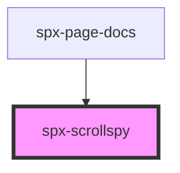

# spx-scrollspy

<!-- Auto Generated Below -->

## Properties

| Property       | Attribute       | Description                                                                                                                                           | Type      | Default                            |
| -------------- | --------------- | ----------------------------------------------------------------------------------------------------------------------------------------------------- | --------- | ---------------------------------- |
| `contentClass` | `content-class` | Applied class to active content element.                                                                                                              | `string`  | `'spx-scrollspy__content--active'` |
| `display`      | `display`       |                                                                                                                                                       | `string`  | `'block'`                          |
| `navClass`     | `nav-class`     | Applied class to active navigation element.                                                                                                           | `string`  | `'spx-scrollspy__nav--active'`     |
| `offset`       | `offset`        | Selects the height of an element (any querySelector value) or number that is used for offsetting how far from the top the next section is activated.. | `any`     | `0`                                |
| `target`       | `target`        | Target element. Can take any querySelector value. (id, class, tag etc.)                                                                               | `string`  | `'a'`                              |
| `urlChange`    | `url-change`    | Appends the currently active link to the end of the URL.                                                                                              | `boolean` | `false`                            |

## Events

| Event                 | Description | Type               |
| --------------------- | ----------- | ------------------ |
| `spxScrollspyDidLoad` |             | `CustomEvent<any>` |

## Methods

### `reload() => Promise<void>`

#### Returns

Type: `Promise<void>`

## Dependencies

### Used by

 - [spx-page-docs](../spx-page)

### Graph

----------------------------------------------

*Built with [StencilJS](https://stenciljs.com/)*
