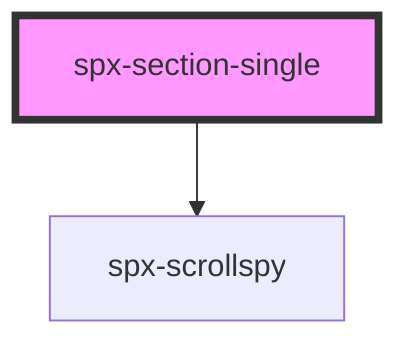

# spx-section-single

<!-- Auto Generated Below -->

## Properties

| Property                             | Attribute                                 | Description | Type      | Default                                         |
| ------------------------------------ | ----------------------------------------- | ----------- | --------- | ----------------------------------------------- |
| `containerMaxWidth`                  | `container-max-width`                     |             | `string`  | `'700px'`                                       |
| `content`                            | `content`                                 |             | `boolean` | `undefined`                                     |
| `contentMarginTop`                   | `content-margin-top`                      |             | `string`  | `'1rem'`                                        |
| `date`                               | `date`                                    |             | `boolean` | `true`                                          |
| `dateColor`                          | `date-color`                              |             | `string`  | `'#999999'`                                     |
| `dateFontSize`                       | `date-font-size`                          |             | `string`  | `'1rem'`                                        |
| `dateMarginTop`                      | `date-margin-top`                         |             | `string`  | `'1.2rem'`                                      |
| `image`                              | `image`                                   |             | `boolean` | `true`                                          |
| `imageBorderRadius`                  | `image-border-radius`                     |             | `string`  | `constants.styleBorderRadius`                   |
| `imageMaxHeight`                     | `image-max-height`                        |             | `string`  | `undefined`                                     |
| `imageObjectPosition`                | `image-object-position`                   |             | `string`  | `'50% 50%'`                                     |
| `mobile`                             | `mobile`                                  |             | `number`  | `constants.styleMobileBP`                       |
| `post`                               | `post`                                    |             | `string`  | `undefined`                                     |
| `styling`                            | `styling`                                 |             | `string`  | `undefined`                                     |
| `tableOfContents`                    | `table-of-contents`                       |             | `boolean` | `undefined`                                     |
| `tableOfContentsBackground`          | `table-of-contents-background`            |             | `string`  | `constants.stylePrimary000`                     |
| `tableOfContentsBorder`              | `table-of-contents-border`                |             | `string`  | `'1px solid ' + constants.stylePrimary100 + ''` |
| `tableOfContentsBorderRadius`        | `table-of-contents-border-radius`         |             | `string`  | `constants.styleBorderRadius`                   |
| `tableOfContentsHeading`             | `table-of-contents-heading`               |             | `string`  | `'Table of contents'`                           |
| `tableOfContentsHeadingColor`        | `table-of-contents-heading-color`         |             | `string`  | `constants.stylePrimary700`                     |
| `tableOfContentsHeadingFontSize`     | `table-of-contents-heading-font-size`     |             | `string`  | `'1.5rem'`                                      |
| `tableOfContentsHeadingMarginBottom` | `table-of-contents-heading-margin-bottom` |             | `string`  | `'1rem'`                                        |
| `tableOfContentsItemColor`           | `table-of-contents-item-color`            |             | `string`  | `constants.stylePrimary600`                     |
| `tableOfContentsItemColorActive`     | `table-of-contents-item-color-active`     |             | `string`  | `constants.stylePrimary900`                     |
| `tableOfContentsItemGap`             | `table-of-contents-item-gap`              |             | `string`  | `'1rem'`                                        |
| `tableOfContentsMarginTop`           | `table-of-contents-margin-top`            |             | `string`  | `'3rem'`                                        |
| `tableOfContentsOffset`              | `table-of-contents-offset`                |             | `any`     | `undefined`                                     |
| `tableOfContentsPadding`             | `table-of-contents-padding`               |             | `string`  | `'2.5rem'`                                      |
| `titleColor`                         | `title-color`                             |             | `string`  | `'#000000'`                                     |
| `titleFontSize`                      | `title-font-size`                         |             | `string`  | `'2rem'`                                        |
| `titleMarginTop`                     | `title-margin-top`                        |             | `string`  | `'2.5rem'`                                      |

## Events

| Event                     | Description | Type               |
| ------------------------- | ----------- | ------------------ |
| `spxSectionSingleDidLoad` |             | `CustomEvent<any>` |

## Dependencies

### Depends on

- [spx-scrollspy](../spx-scrollspy)

### Graph

----------------------------------------------

*Built with [StencilJS](https://stenciljs.com/)*
