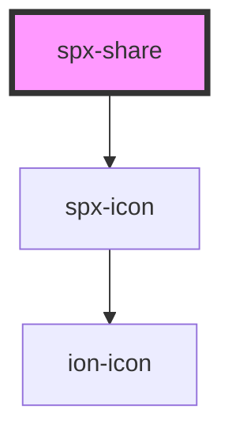

# spx-share

<!-- Auto Generated Below -->

## Properties

| Property                       | Attribute                         | Description                | Type      | Default                             |
| ------------------------------ | --------------------------------- | -------------------------- | --------- | ----------------------------------- |
| `fontSize`                     | `font-size`                       |                            | `string`  | `c.fontSize`                        |
| `itemBackground`               | `item-background`                 |                            | `string`  | `undefined`                         |
| `itemBorderRadius`             | `item-border-radius`              |                            | `string`  | `c.borderRadius`                    |
| `itemColor`                    | `item-color`                      | Gap between buttons.       | `string`  | `undefined`                         |
| `itemFilterHover`              | `item-filter-hover`               | Filter hover.              | `string`  | `'brightness(110%) saturate(120%)'` |
| `itemGap`                      | `item-gap`                        | Gap between buttons.       | `string`  | `'0.5em'`                           |
| `itemPadding`                  | `item-padding`                    |                            | `string`  | `'0.5em'`                           |
| `itemSize`                     | `item-size`                       |                            | `string`  | `'1em'`                             |
| `itemTransitionDuration`       | `item-transition-duration`        |                            | `string`  | `c.transitionDuration`              |
| `itemTransitionTimingFunction` | `item-transition-timing-function` |                            | `string`  | `c.transitionTimingFunction`        |
| `target`                       | `target`                          | Button href target.        | `string`  | `'_blank'`                          |
| `theme`                        | `theme`                           | Button theme.              | `string`  | `'default'`                         |
| `vertical`                     | `vertical`                        | Render buttons vertically. | `boolean` | `undefined`                         |

## Methods

### `reload() => Promise<void>`

#### Returns

Type: `Promise<void>`

## Dependencies

### Depends on

- [spx-icon](../spx-icon)

### Graph

----------------------------------------------

*Built with [StencilJS](https://stenciljs.com/)*
