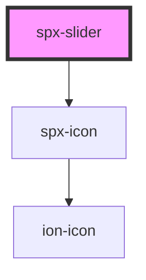

# spx-slider

<!-- Auto Generated Below -->

## Properties

| Property                             | Attribute                               | Description                                               | Type      | Default                       |
| ------------------------------------ | --------------------------------------- | --------------------------------------------------------- | --------- | ----------------------------- |
| `autoheight`                         | `autoheight`                            | Automatically adjusts height of slider.                   | `boolean` | `false`                       |
| `autoplay`                           | `autoplay`                              | Starts navigating to the next slide when page is loaded.  | `boolean` | `false`                       |
| `autoplayDelay`                      | `autoplay-delay`                        | Autoplay delay.                                           | `number`  | `6000`                        |
| `autoplayDisableOnInteraction`       | `autoplay-disable-on-interaction`       | Disable autoplay after interaction with slides.           | `boolean` | `false`                       |
| `centeredSlides`                     | `centered-slides`                       | Centers slides in viewport.                               | `boolean` | `false`                       |
| `display`                            | `display`                               |                                                           | `string`  | `s.display`                   |
| `effect`                             | `effect`                                | Slider effect.                                            | `string`  | `'slide'`                     |
| `imageObjectFit`                     | `image-object-fit`                      | Image object-fit.                                         | `string`  | `'cover'`                     |
| `imageSize`                          | `image-size`                            | WordPress media size when using the helper function.      | `string`  | `undefined`                   |
| `imageSrc`                           | `image-src`                             | Gets images from an ACF or Metabox field.                 | `string`  | `undefined`                   |
| `images`                             | `images`                                | Gets images from an ACF or Metabox field.                 | `string`  | `undefined`                   |
| `lazy`                               | `lazy`                                  | Lazy load images.                                         | `boolean` | `undefined`                   |
| `lazyLoadPrevNext`                   | `lazy-load-prev-next`                   | Amount of images to to be preloaded when lazy is enabled. | `number`  | `undefined`                   |
| `loop`                               | `loop`                                  | Loops all slides infinitely.                              | `boolean` | `undefined`                   |
| `maxHeight`                          | `max-height`                            |                                                           | `string`  | `undefined`                   |
| `navigation`                         | `navigation`                            |                                                           | `boolean` | `undefined`                   |
| `navigationBackground`               | `navigation-background`                 |                                                           | `string`  | `'rgba(0,0,0,0.7)'`           |
| `navigationBackgroundHover`          | `navigation-background-hover`           |                                                           | `string`  | `'rgba(0,0,0,1)'`             |
| `navigationBorderRadius`             | `navigation-border-radius`              |                                                           | `string`  | `s.borderRadius`              |
| `navigationColor`                    | `navigation-color`                      |                                                           | `string`  | `'#ffffff'`                   |
| `navigationDistanceX`                | `navigation-distance-x`                 | Navigation distance.                                      | `string`  | `'12px'`                      |
| `navigationIconNext`                 | `navigation-icon-next`                  | Navigation icon type.                                     | `string`  | `'arrow-forward'`             |
| `navigationIconPrev`                 | `navigation-icon-prev`                  | Navigation icon type.                                     | `string`  | `'arrow-back'`                |
| `navigationIconType`                 | `navigation-icon-type`                  | Navigation icon type.                                     | `string`  | `'ionicons'`                  |
| `navigationPadding`                  | `navigation-padding`                    |                                                           | `string`  | `'12px'`                      |
| `navigationSize`                     | `navigation-size`                       | Navigation size.                                          | `string`  | `'20px'`                      |
| `navigationTransitionDuration`       | `navigation-transition-duration`        |                                                           | `string`  | `s.transitionDuration`        |
| `navigationTransitionTimingFunction` | `navigation-transition-timing-function` |                                                           | `string`  | `s.transitionTimingFunction`  |
| `pagination`                         | `pagination`                            | Pagination type.                                          | `string`  | `'bullets'`                   |
| `paginationBulletsBackground`        | `pagination-bullets-background`         |                                                           | `string`  | `'var(--spx-color-gray-400)'` |
| `paginationBulletsBackgroundActive`  | `pagination-bullets-background-active`  |                                                           | `string`  | `'var(--spx-color-gray-900)'` |
| `paginationBulletsClickable`         | `pagination-bullets-clickable`          | Make bullets clickable.                                   | `boolean` | `undefined`                   |
| `paginationBulletsDynamic`           | `pagination-bullets-dynamic`            | Will only keep a selected amount of bullets visible.      | `boolean` | `undefined`                   |
| `paginationBulletsDynamicAmount`     | `pagination-bullets-dynamic-amount`     | Amount of dynamic bullets.                                | `number`  | `5`                           |
| `paginationBulletsSize`              | `pagination-bullets-size`               | Size of the bullets.                                      | `string`  | `'8px'`                       |
| `paginationBulletsSpaceBetween`      | `pagination-bullets-space-between`      | Space between the bullets.                                | `string`  | `'8px'`                       |
| `paginationTransitionDuration`       | `pagination-transition-duration`        |                                                           | `string`  | `s.transitionDuration`        |
| `paginationTransitionTimingFunction` | `pagination-transition-timing-function` |                                                           | `string`  | `s.transitionTimingFunction`  |
| `prevNextFilter`                     | `prev-next-filter`                      | Filter property for the previous and next elements.       | `string`  | `undefined`                   |
| `slideMessageFirst`                  | `slide-message-first`                   | Screen reader message for first slide.                    | `string`  | `'This is the first slide'`   |
| `slideMessageLast`                   | `slide-message-last`                    | Screen reader message for last slide.                     | `string`  | `'This is the last slide'`    |
| `slideMessageNext`                   | `slide-message-next`                    | Screen reader message for next slide.                     | `string`  | `'Next slide'`                |
| `slideMessagePrevious`               | `slide-message-previous`                | Screen reader message for previous slide.                 | `string`  | `'Previous slide'`            |
| `slidesPerView`                      | `slides-per-view`                       | Amount of slides shown at once.                           | `number`  | `1`                           |
| `spaceBetween`                       | `space-between`                         | Space between slides.                                     | `number`  | `0`                           |
| `speed`                              | `speed`                                 | Sliding speed.                                            | `number`  | `1000`                        |

## Events

| Event              | Description                       | Type               |
| ------------------ | --------------------------------- | ------------------ |
| `spxSliderDidLoad` | Fires after component has loaded. | `CustomEvent<any>` |

## Slots

| Slot      | Description               |
| --------- | ------------------------- |
| `"inner"` | Slot (between HTML tags). |

## Dependencies

### Depends on

- [spx-icon](../spx-icon)

### Graph

----------------------------------------------

*Built with [StencilJS](https://stenciljs.com/)*
