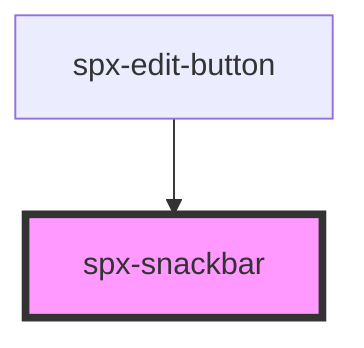

# spx-snackbar

<!-- Auto Generated Below -->

## Properties

| Property            | Attribute            | Description | Type      | Default                       |
| ------------------- | -------------------- | ----------- | --------- | ----------------------------- |
| `animationDelay`    | `animation-delay`    |             | `string`  | `'200ms'`                     |
| `animationDuration` | `animation-duration` |             | `string`  | `'2s'`                        |
| `background`        | `background`         |             | `string`  | `constants.styleBackground`   |
| `border`            | `border`             |             | `string`  | `undefined`                   |
| `borderRadius`      | `border-radius`      |             | `string`  | `constants.styleBorderRadius` |
| `closeable`         | `closeable`          |             | `boolean` | `undefined`                   |
| `color`             | `color`              |             | `string`  | `constants.styleColor`        |
| `distanceX`         | `distance-x`         |             | `string`  | `'1em'`                       |
| `distanceY`         | `distance-y`         |             | `string`  | `'1em'`                       |
| `fixed`             | `fixed`              |             | `boolean` | `undefined`                   |
| `fontSize`          | `font-size`          |             | `string`  | `'18px'`                      |
| `padding`           | `padding`            |             | `string`  | `'20px'`                      |
| `position`          | `position`           |             | `string`  | `'bottom-center'`             |
| `reverse`           | `reverse`            |             | `boolean` | `undefined`                   |
| `size`              | `size`               |             | `string`  | `undefined`                   |
| `styling`           | `styling`            |             | `string`  | `undefined`                   |
| `text`              | `text`               |             | `string`  | `"Hello, I'm a snackbar."`    |

## Dependencies

### Used by

 - [spx-edit-button](../spx-edit-button)

### Graph

----------------------------------------------

*Built with [StencilJS](https://stenciljs.com/)*
